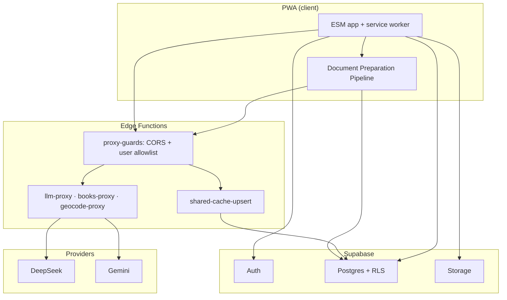

# Pith

[](.github/workflows/ci.yml)

**AI study PWA:** upload documents, run a preparation pipeline, then study across RSVP, reading, cloze, recall, and spaced review with a cross-document knowledge vault.

**Status:** Feature-frozen portfolio project — not maintained as a product. Live demo at [pith.pedrojon.com](https://pith.pedrojon.com) is invite-only (platform LLM keys + proxy allowlist).


_Add `docs/media/demo.gif` locally (see [docs/repo-artifacts.md](docs/repo-artifacts.md)); path is tracked once the file exists._

## What it does

- Normalizes uploads (PDF/HTML/text) and runs **Document Preparation Pipeline (DPP)** analysis into per-session shared artifacts consumed by all study modes ([spec](specs/20260618-document-preparation-frontload/spec.md)).
- Runs multi-mode study (RSVP, read, slow, questions, cloze, recall) and **Knowledge Vault** review with embeddings and SM-2 scheduling ([vault spec](specs/20260618-knowledge-vault-a-plus/spec.md), [SM-2 spec](specs/20260620-sm2-priority-queue/spec.md)).
- Persists sessions and vault data in **Supabase**; LLM and external API calls go through **Edge Function proxies** (no provider keys in the browser).

## Architecture



Client-orchestrated DPP writes prepared artifacts to `DocumentSession.shared` and optional shared DB caches ([`src/js/shared-dpp-cache-persist.js`](src/js/shared-dpp-cache-persist.js)). Proxy behavior: [`supabase/functions/_shared/proxy-guards.ts`](supabase/functions/_shared/proxy-guards.ts), [`specs/20260622-platform-key-proxy/spec.md`](specs/20260622-platform-key-proxy/spec.md).

## Engineering highlights

- **Document normalization** — PDF/HTML ingestion, hierarchy, and markdown emit under [`src/js/normalization/`](src/js/normalization/).
- **Structured LLM JSON + failure taxonomy** — `TRUNCATED` / `PARSE_ERROR` / `SCHEMA_ERROR` handling in [`src/js/api.js`](src/js/api.js) (see also [`.cursorrules`](.cursorrules)).
- **Fail-closed platform proxy** — browser origin allowlist and empty `LLM_PROXY_ALLOWED_USER_IDS` → 403 unless `LLM_PROXY_ALLOW_ALL=true` ([`supabase/functions/_shared/proxy-guards.ts`](supabase/functions/_shared/proxy-guards.ts), [`supabase/functions/llm-proxy/`](supabase/functions/llm-proxy/)).
- **Knowledge vault embeddings + SM-2** — [`specs/20260629-vault-embedding/spec.md`](specs/20260629-vault-embedding/spec.md), [`src/js/sm2.js`](src/js/sm2.js).
- **RLS + shared cache** — migrations including [`supabase/migrations/20261005140000_cache_key_read_edge_writes.sql`](supabase/migrations/20261005140000_cache_key_read_edge_writes.sql), [`supabase/migrations/20261005_lock_shared_caches_rls.sql`](supabase/migrations/20261005_lock_shared_caches_rls.sql); edge writer [`supabase/functions/shared-cache-upsert/`](supabase/functions/shared-cache-upsert/).

## How it was built

**Spec-driven:** 97 spec directories under [`specs/`](specs/) (plus flagship index in [`specs/README.md`](specs/README.md)). Representative contracts: [document preparation frontload](specs/20260618-document-preparation-frontload/spec.md), [loop engineering orchestrator](specs/20260718-loop-engineering/spec.md).

**Loop-engineering orchestrator** ([`orchestrator/`](orchestrator/)) automates a large audit inventory: `build-manifest` groups processes with hub-file locks so concurrent agents do not edit the same files (`study.js`, `api.js`, `session-store.js`); each process runs **test-agent** (writes `cursor-tests/loop-engineering/<id>.mjs`) then **fix-agent** (product code only), with verification before merge. Entry point: [`orchestrator/main.py`](orchestrator/main.py). Tests: [`tests/orchestrator/`](tests/orchestrator/). Details: [`orchestrator/README.md`](orchestrator/README.md).

## Known limitations

- **`study.js` (~10k lines)** — mode orchestration, RSVP, and DPP UI hooks share one module; split into mode-specific modules behind a thin router.
- **Client state** — session and prefs split between `localStorage` and Supabase rows; consolidate behind a single sync layer with explicit migration.
- **No end-to-end browser tests** — CI runs Node tests (`npm test`) and orchestrator pytest, not Playwright/Cypress against a real browser stack.

## Local run

```bash
git clone <your-fork-url>
cd pith
npm ci
npm test          # JS smoke (package.json) + tests/orchestrator pytest
npx serve .       # static PWA from repo root
```

Supabase project with Edge Functions deployed; secret **names** (values in dashboard / [`.env.example`](.env.example)):

- `SUPABASE_SERVICE_ROLE_KEY`, `DEEPSEEK_API_KEY`, `GEMINI_API_KEY`, `GOOGLE_BOOKS_API_KEY`
- `PITH_CORS_ORIGINS` — comma-separated browser origins (unset / not listed → **403** on proxies)
- `LLM_PROXY_ALLOWED_USER_IDS` — comma-separated auth user UUIDs (**empty → 403**, fail closed)
- Optional dev escape: `LLM_PROXY_ALLOW_ALL=true` (do not use in production)
- Optional: `LLM_PROXY_MAX_PER_HOUR`, `LLM_PROXY_ALLOWED_MODELS`

**Demo without login:** `?demo=1` (prepared sample, AI disabled).

Layout notes: [docs/repo-artifacts.md](docs/repo-artifacts.md). Deploy: [DEPLOY.md](DEPLOY.md). Google OAuth: [GOOGLE_OAUTH_SETUP.md](GOOGLE_OAUTH_SETUP.md). UI constraints: [DESIGN.md](DESIGN.md).

## License

[MIT](LICENSE) — Copyright (c) 2026 Pedro Fuentes.
