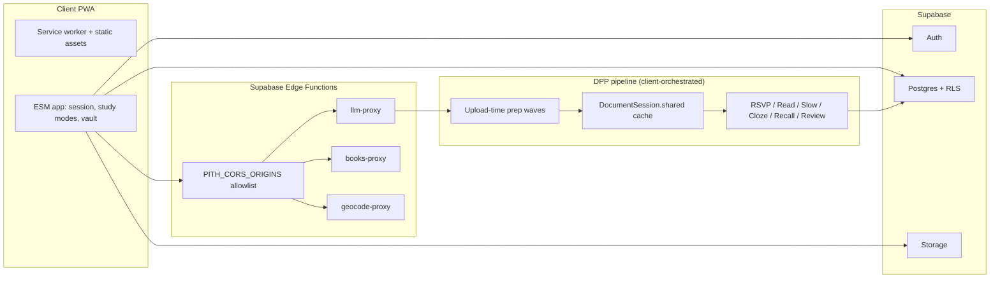

# Pith

[](.github/workflows/ci.yml)

AI study PWA: turn documents into faithful, multi-mode study sessions, then consolidate what you learn in a cross-document knowledge vault. Preparation stays tied to the source; practice spans RSVP, reading, slow study, questions, cloze, recall, and spaced review.

<!-- Record steps: docs/demo-flow.md -->


## Try it

**Live demo:** [https://pith.pedrojon.com](https://pith.pedrojon.com)

AI features use **allowlisted** platform keys (invite-only). To run with your own backend, fork the repo and wire up your Supabase project.

Edge proxies enforce a **fail-closed** browser allowlist via `PITH_CORS_ORIGINS` (comma-separated origins). If it is unset or your origin is not listed, cross-origin proxy calls return **403** — intentional for a public repo with a live demo.

## A hard technical decision: DPP source fidelity over lazy generation

**Problem.** Study apps often generate flashcards or summaries on demand inside each mode. That is fast to ship but drifts from the uploaded document: modes disagree, users wait again at every entry, and there is no single place to audit what the model actually inferred from the source.

**Options considered (and rejected).**

- **Per-mode LLM passes** — Each mode re-runs document understanding. Cheaper upfront, but duplicate cost, inconsistent inventories, and no shared ground truth for the vault.
- **One mega-prompt at upload** — Single call is simple but brittle (truncation, hard to resume, opaque failures) and fights map-reduce needs on long documents.
- **Generate everything for RSVP at import** — Block packing, per-block explanations, and assessments stay user-driven inside RSVP; front-loading all of that would burn tokens before the user commits to a block count.

**What we chose.** **Document Preparation Pipeline (DPP)** front-loads reusable analysis into `DocumentSession.shared` after upload: hierarchy, concept inventory, relations, block *recommendation* (not packed blocks), cloze items, recall questions, and slow orientation where applicable. Study modes consume those artifacts; generative DPP contracts stay **scoped** to the document (chat-only dual-context is separate). Tier-3 work (e.g. RSVP block study generation) still runs inside the mode but must not re-inventor the document. One fixed document per session; new content ⇒ new session.

See [specs/20260618-document-preparation-frontload/](specs/20260618-document-preparation-frontload/) for the full contract.

## Architecture



The PWA talks to Supabase for auth and data; LLM and external API calls go through Edge Function proxies so secrets and allowlists stay server-side.

For UI and product constraints, see [DESIGN.md](DESIGN.md). Flagship specs (full index: [specs/README.md](specs/README.md)):

- [specs/20260618-document-preparation-frontload/](specs/20260618-document-preparation-frontload/)
- [specs/20260622-platform-key-proxy/](specs/20260622-platform-key-proxy/)
- [specs/20260618-knowledge-vault-a-plus/](specs/20260618-knowledge-vault-a-plus/)
- [specs/20260701-pedagogical-principles/](specs/20260701-pedagogical-principles/)

## Loop-engineering orchestrator (`orchestrator/`)

**Read this before assuming the orchestrator is “the app server.”** It is a **development automation** tool from the July 2026 hardening push (~589 commits that month on this repo) to work through a large process inventory without hand-merging every fix.

**What it does.**

- Parses the audit process inventory into flow groups (`build-manifest` → `orchestrator/generated/flow_groups.json`).
- For each process: a **test-agent** writes `cursor-tests/loop-engineering/<process_id>.mjs`, a **fix-agent** may change product source (not the test), then **verification** runs before any merge.
- Schedules concurrent flow-groups with **hub-file locks** (`study.js`, `api.js`, `session-store.js`) so agents do not stomp the same files.
- Persists progress in `progress/state.json`, notifies via ntfy, and can resume after crashes or rate limits.

**How agent work is verified.**

1. **Tier 1** — Run the process Node test (`node cursor-tests/loop-engineering/<id>.mjs`).
2. **Tier 2** — Grounding checks (embedding cosine vs source) for fragile/LLM-heavy processes when Tier 1 is insufficient.
3. **Tier 3** — LLM judge escalation when configured.

Before merging to `main`, the orchestrator runs the **full accumulated** `cursor-tests/loop-engineering/*.mjs` suite on a throwaway merge; a passing single-process test is not enough if it regresses earlier work. Normalization/DPP T0–T1 processes can attach fixture **rubrics** as ground truth in prompts.

Entry point: `orchestrator/main.py` (`setup`, `build-manifest`, `run`). Spec: [specs/20260718-loop-engineering/](specs/20260718-loop-engineering/).

## Stack

- **Client:** Vanilla ESM PWA (service worker, offline-friendly static assets)
- **Hosting:** Vercel (static)
- **Backend:** Supabase Auth, Postgres, Storage, Edge Functions (`llm-proxy`, `books-proxy`, `geocode-proxy`, `shared-cache-upsert`)
- **Models:** DeepSeek and Gemini via server-side proxy — no provider API keys in the browser

## Local run

```bash
git clone <your-fork-url>
cd pith
npm ci
npm test          # CI smoke JS + orchestrator pytest
# npm run test:js:full   # full cursor-tests (many fixtures are stale)
npx serve .   # or any static server from the repo root
```

You need your own Supabase project with Edge Functions deployed and secrets set (names only):

- `SUPABASE_SERVICE_ROLE_KEY`
- `DEEPSEEK_API_KEY`
- `GEMINI_API_KEY`
- `GOOGLE_BOOKS_API_KEY`
- `PITH_CORS_ORIGINS` — e.g. `http://localhost:3000,https://pith.pedrojon.com`
- `LLM_PROXY_ALLOWED_USER_IDS` — comma-separated auth user ids (**empty env = 403**, fail closed)
- Optional: `LLM_PROXY_MAX_PER_HOUR`, `LLM_PROXY_ALLOWED_MODELS`

**Demo without login:** open the app with `?demo=1` (prepared Gettysburg sample, AI disabled).

Repo layout notes: [docs/repo-artifacts.md](docs/repo-artifacts.md).

Production deploy checklist: [DEPLOY.md](DEPLOY.md). Copy [`.env.example`](.env.example) for Edge Function secret names.

Google sign-in setup: [GOOGLE_OAUTH_SETUP.md](GOOGLE_OAUTH_SETUP.md).

## Status and scope

This is a **personal, single-tenant** research tool: one primary user, allowlisted LLM proxy access, and RLS patterns aimed at that use case — not a multi-tenant SaaS.

A real multi-user deployment would need, at minimum: per-tenant isolation and quotas on storage and LLM proxy usage, self-serve API key or billing instead of platform allowlists, hardened auth/session review, operational monitoring, and explicit data retention/export policies.

## Known limitations

- **`study.js` is still a large hub module** — mode orchestration, RSVP flows, and DPP UI hooks live together; ongoing work splits concerns into smaller modules (see loop-engineering inventory and specs that reference `block-answer-signals`, vault curation, etc.).
- **Long documents** — Map-reduce and truncation fallbacks add complexity; some paths still surface slow prep or degraded modes when limits hit.
- **LLM variance** — Deterministic tests cover structure; generative quality still depends on model behavior and proxy limits.
- **Orchestrator inventory** — Paths like `audit/process-inventory-20260717.md` are part of the loop-engineering workflow; they document processes, not runtime dependencies of the PWA.
- **Embedding-assisted inventory merge** — Optional, flag-gated; default merge paths still lean on LLM dedup when embeddings are off or unavailable.

## License

[MIT](LICENSE) — Copyright (c) 2026 Pedro Fuentes.
