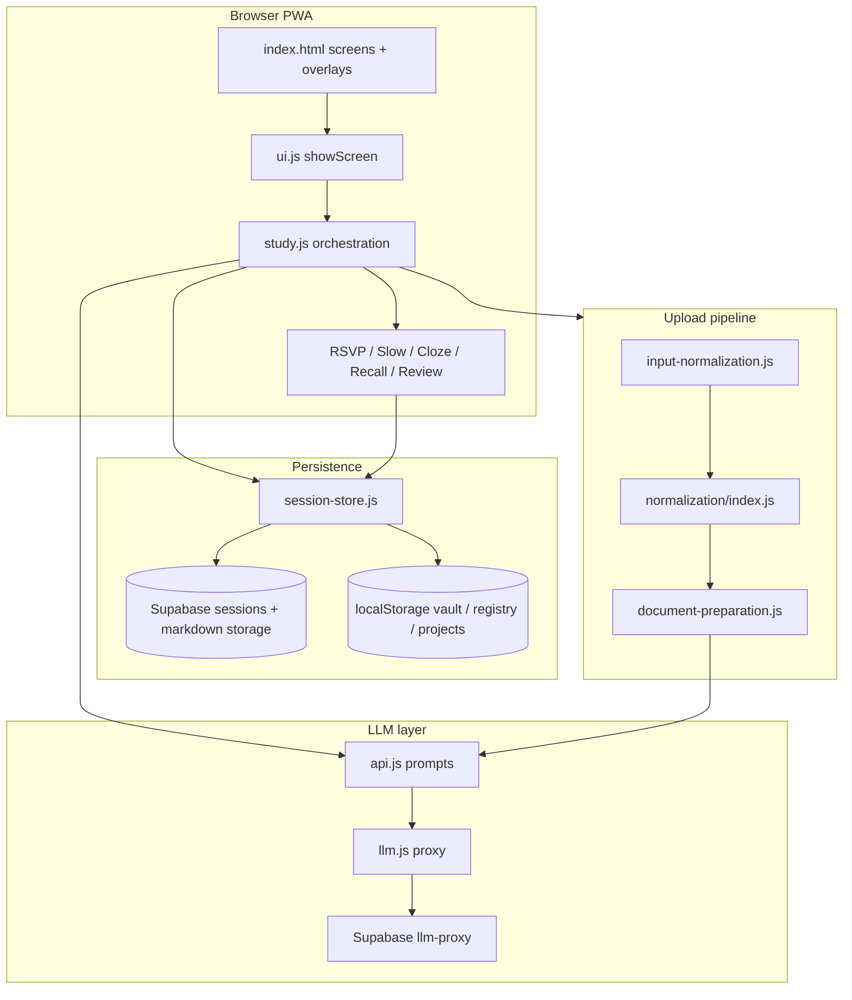
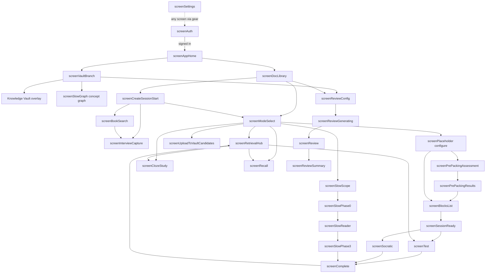

# Pith — Application Overview

> Generated from live source code (not from a prior overview). Last updated: **2026-06-28**.

---

## 1. What it is

**Pith** is a browser-based PWA for AI-assisted study of uploaded documents (PDF, HTML, TXT, MD). Learners upload material (or capture knowledge via a no-file interview), run an upload-time **Document Preparation Pipeline (DPP)** that builds shared artifacts (concept inventory, hierarchy, flow recommendation, optional Tier-2 mode prep), then study in one of six modes: **RSVP**, **Questions**, **Slow**, **Cloze**, **Recall**, or cross-document **Review**. A **Knowledge Vault** and **concept registry** persist mastery, spaced repetition (SM-2), mnemonics, and cross-document links. The stack is vanilla ES modules (no bundler), Supabase Auth + Storage for session sync, and LLM calls routed through a Supabase Edge Function proxy (DeepSeek for chat; Gemini for embeddings/vision). Offline-capable via a service worker with explicit update UX.

---

## 2. Stack and code organization

| Layer | Technology |
|-------|------------|
| UI | HTML sections (`screen*`), CSS modules, `ui.js` screen router |
| App logic | ES modules under `src/js/` |
| Persistence | Supabase (`session-persist-supabase.js`), `localStorage` (vault, registry, projects, legacy keys) |
| Auth | Supabase Google OAuth (`auth.js`, `supabase-client.js`) |
| LLM | `llm.js` → Supabase `llm-proxy` (DeepSeek chat, Gemini embed/vision) |
| PWA | `sw.js`, `sw-update.js`, `manifest.json`, install prompt in `index.html` + `pwa-install.js` |
| Math / MD | MathJax CDN, `marked` CDN, `markdown.js` |
| PDF | pdf.js via `normalization/pdf-loader.js` |

### Directory tree (current)

```
mylearning/
├── index.html              # All screens, overlays, chrome, boot scripts
├── manifest.json
├── sw.js                   # CACHE_NAME = "pith-v98"
├── src/
│   ├── css/
│   │   ├── main.css
│   │   ├── sidebar.css
│   │   ├── slow-mode.css
│   │   ├── cloze-mode.css
│   │   ├── recall-mode.css
│   │   ├── graph.css
│   │   ├── mnemonic.css
│   │   └── design-enforcement.css
│   └── js/
│       ├── main.js                 # Bootstrap, auth, wire handlers
│       ├── ui.js                   # showScreen(), els, chrome, breadcrumbs
│       ├── study.js                # Primary orchestration (~9k lines)
│       ├── session.js              # Block packing, RSVP runtime, legacy slice I/O
│       ├── session-store.js        # DocumentSession CRUD, Supabase sync
│       ├── session-types.js        # DocumentSession types, DPP prep state
│       ├── document-preparation.js # DPP orchestrator
│       ├── input-normalization.js  # Upload facade → markdown
│       ├── normalization/          # Structure inference pipeline
│       ├── api.js                  # LLM prompts/parsers (inventory, blocks, assessment)
│       ├── llm.js                  # Proxy client
│       ├── config.js, config/flags.js, config/supabase.js
│       ├── mode-taxonomy.js, mode-bootstrap.js
│       ├── recommendation/         # Flow recommender, analyzer, tracker
│       ├── graph/                  # Build, canvas, view, adapters
│       ├── slow/                   # Reader, phases 0/3, pagination, sidebar
│       ├── cloze/                  # Pipeline, study, export-import
│       ├── recall-study.js, recall-api.js, recall-slice.js
│       ├── review.js               # SM-2 + generated review flows
│       ├── vault/                  # Vault store, curation, embeddings, session-close
│       ├── concept-registry/       # Global registry, dedup, promotion
│       ├── document-images/        # Extract, vision, tokens, storage
│       ├── interview/              # No-doc capture, book lookup
│       ├── adaptive-probing/       # Belief propagation for assessment
│       ├── pedagogy/               # Factual classifier, comprehension gate, pools
│       ├── sm2.js, sm2-ingest.js
│       ├── export.js, export-format.js, offline.js
│       ├── project-store.js, project-library.js
│       ├── mnemonic.js, guide-chat.js, dictionary.js
│       ├── rsvp.js, paced-reader.js, sneakPeek.js
│       └── sw-update.js            # SW_VERSION = "20260628_08"
└── specs/                          # Feature specs (folder per feature)
```

### Architecture diagram



---

## 3. Data model

### DocumentSession (schemaVersion 2 or 3)

| Field | Type | Notes |
|-------|------|-------|
| `docId` | `string` | Hash of normalized markdown |
| `schemaVersion` | `2 \| 3` | v3 adds `shared.preparation`, `shared.images`, etc. |
| `createdAt`, `updatedAt` | `number` | ms epoch |
| `projectId` | `string?` | Study project; defaults to `misc` after migration |
| `shared` | `SharedLayer` | Cross-mode document data |
| `modes` | `ModeSlices` | Per-mode nullable slices |

**Active pointer:** `localStorage['pith_active_doc_id']`  
**Session rows:** Supabase via `session-persist-supabase.js` (replaces inline `pith_doc_sessions` array for primary storage when authenticated).

### `shared` fields

| Field | Purpose |
|-------|---------|
| `rawMarkdown` | Inline canonical text (when small) |
| `rawMarkdownRef` | `{ storageKey, charCount }` when externalized to Supabase Storage |
| `docMeta` | `{ titleInferred, charCount, language, estimatedGenre }` |
| `docHierarchy` | LLM or deterministic section tree + `pedagogical_meta` |
| `docTopics` | Topic tags from hierarchy |
| `conceptInventory` | Shared concept list (`canonicalId`, `label`, `definition`, `globalConceptId`, `questionClass`, …) |
| `conceptGraph` | Epistemic graph nodes/edges (from DPP T1.3 / Cloze) |
| `annotations` | Slow-mode annotations (promoted from slices) |
| `smItems` | Canonical SM-2 items for this document |
| `assessmentSignals` | Cross-mode wrong/correct concept signals |
| `modeRecommendation` | `{ primaryFlow, reasoning, estimatedMinutes, … }` |
| `blockRecommendation` | `{ nBlocks, rationale, signals, computedAt }` |
| `textMetrics` | Output of `recommendation/analyzer.js` |
| `preparation` | DPP state machine (status, phases, errors) |
| `uploadMeta` | `{ fileName, originalFormat, uploadedAt, bookMeta? }` |
| `slowOrientation` | Cached Phase 0 payload from DPP T2.3 |
| `mergeProposals` | Vault dedup proposals from T1.8 |
| `mnemonicDevices` | User-authored mnemonics only |
| `interviewTranscript`, `interviewSynthesisComplete` | No-doc interview capture |
| `images` | `DocumentImage[]` for embedded/full-page figures |

### `modes.*` slices

| Mode key | Slice shape (high level) |
|----------|--------------------------|
| `rsvp` | `{ studyMode, n_blocks, blocks[], blocksRef?, _responses, _meta: { knowledge_profile, rev, session_id }, language, llmModel, materialMeta }` |
| `questions` | Same block shape as RSVP; quiz-only (no RSVP overlay path) |
| `slow` | `{ studyMode, slow: { normalizedTextFull, phase, readingScope, phase0, annotations, findings, … }, docHierarchy, materialMeta }` |
| `cloze` | `{ studyMode, cloze: { normalizedText, pipelineStatus, epistemicGraph, items[], studyIndex, studyStats } }` |
| `recall` | `{ status, questions[], currentIndex, config: { questionCount, types, scope } }` — see `recall-slice.js` |
| ~~`review`~~ | **Removed** from `modes`; vault-scoped review uses `review.js` + `shared.smItems` / vault review items |

`modes.review` is stripped on load (`session-store.js` L163–166).

### Other stores

| Store | Key / location | Schema |
|-------|----------------|--------|
| Knowledge Vault | `pith_knowledge_vault` / `pith_knowledge_vault_data` | v3 entries, reviewItems, importHistory |
| Concept registry | `mylearning_concept_registry` | v2 concepts, connections, observations |
| Projects | `mylearning_projects` | v1 tree of `Project` nodes |
| Legacy slices | `sessions_by_mode`, `active_session` | V1; migrated to DocumentSession |
| Blocks externalized | `pith_doc_blocks_{docId}` | Large RSVP/Questions block arrays |
| Responses externalized | `pith_doc_responses_{docId}` | Question response blobs |

---

## 4. User navigation flow



### Screen map

| HTML `id` | `showScreen()` id | Role |
|-----------|-------------------|------|
| `screenAuth` | `auth` | Google sign-in gate |
| `screenSettings` | `settings` | Account, language, mnemonic chrome, source fidelity |
| `screenAppHome` | `appHome` | Vault vs Sessions fork |
| `screenVaultBranch` | `vaultBranch` | Vault graph, ingest, review entry |
| `screenCreateSessionStart` | `createSessionStart` | Upload + name session; triggers DPP |
| `screenBookSearch` | `bookSearch` | Optional book lookup for interview |
| `screenInterviewCapture` | `interviewCapture` | No-file knowledge capture |
| `screenModeSelect` | `modeSelect` | Flow recommendation + manual mode picker |
| `screenUploadToVaultCandidates` | `uploadToVaultCandidates` | Vault curation from document |
| `screenRetrievalHub` | `retrievalHub` | Document-scoped retrieval mode hub |
| `screenDocLibrary` | `docLibrary` | Project tree + document library |
| `screenPlaceholder` | `create` | Per-mode configure / generate (legacy name) |
| `screenPrePackingAssessment` | `prePackingAssessment` | Pre-study knowledge check |
| `screenPrePackingResults` | `prePackingResults` | Assessment profile + accept/ignore |
| `screenBlocksList` | `blocks` | Edit block titles before study |
| `screenSessionReady` | `ready` | Start studying / full offline pack |
| `screenFullPackGenerating` | `fullPackGenerating` | Offline pack progress |
| `screenTest` | `test` | RSVP reader + MCQ in block |
| `screenSocratic` | `socratic` | Socratic tutor per block |
| `screenComplete` | `complete` | Session stats + practice retrieval |
| `screenReviewConfig` | `reviewConfig` | Scope, blocks, SM-2 vs generated review |
| `screenReviewGenerating` | `reviewGenerating` | LLM review question generation |
| `screenReview` | `review` | Review runner (SM-2 or generated) |
| `screenReviewSummary` | `reviewSummary` | Review complete summary |
| `screenSlowScope` | `slowScope` | Section picker + options |
| `screenSlowPhase0` | `slowPhase0` | AI orientation |
| `screenSlowReader` | `slowReader` | Paginated reader (full-bleed, outside `.container`) |
| `screenSlowPhase3` | `slowPhase3` | Consolidation modules |
| `screenSlowGraph` | `slowGraph` | Material / vault concept graph |
| `screenRecall` | `recall` | Open-ended recall + tutor |
| `screenClozeStudy` | `clozeStudy` | Cloze MC study |

**Aliases:** `showScreen("setup")` → `settings`. If `modeSelect` DOM is missing, `modeSelect` falls back to `create`.

### Deleted / unreachable screens

| Screen | Status |
|--------|--------|
| `screenBetweenBlocks` | Removed (`ui-dead-weight-removal`); comment in `dictionary.js` L508 |
| `screenApiSetup` | Removed; API keys deprecated — settings now has language + fidelity only |
| `screenInitialAssessment` / `screenAssessmentGenerating` | Not present in `index.html` (superseded by pre-packing assessment) |
| `loadOfflinePackBtn`, `offlinePackInput` | Removed from HTML per dead-weight spec |

### Overlays and global chrome

| Element `id` | Role |
|--------------|------|
| `app-splash` | Boot splash (sessionStorage `pith_splash_seen`) |
| `bootErrorBanner` | Module load failure banner |
| `guide-sidebar` + `sidebar-toggle-btn` | Study guide chat (RSVP/Cloze/Questions/Recall) |
| `block-read-sidebar` + `block-read-toggle-btn` | Re-read current block text (RSVP test/socratic) |
| `mnemonicPanel` + `mnemonicBtn` | Mnemonic device editor FAB |
| `settingsBtn` | Settings gear (always visible) |
| `installPwaBtn` | PWA install (visible on `appHome` when prompt available) |
| `studyProgress` | Block progress bar (test/socratic) |
| `dictionaryOverlay` | Global dictionary popup |
| `summaryOverlay` | “Summary so far” LLM overlay |
| `rsvpOverlay` | Full-screen RSVP word flash reader |
| `pacedReaderOverlay` | Paginated “normal reading” for RSVP blocks |
| `knowledgeVaultOverlay` | Knowledge Vault debug/manage panel |
| `vaultModal` | Vault edit modal |
| `vaultUploadResumeBanner` | Resume interrupted vault upload queue |

---

## 5. Normalization pipeline

**Input formats:** `pdf`, `html`, `txt`, `md` (`input-normalization.js` → `SUPPORTED_INPUT_FORMATS`)  
**Output:** Canonical **markdown** string stored in `shared.rawMarkdown` (or Supabase ref).

### Key functions

| Function | File | Role |
|----------|------|------|
| `normalizeStudyMaterial(raw, format)` | `input-normalization.js` | Public upload entry |
| `normalizeDocumentStructure(raw, format)` | `normalization/index.js` | Structure inference → markdown |
| `stripArtifacts` | `normalization/strip-artifacts.js` | Page numbers, headers, repetition |
| `extractPdfBlocks` / `extractHtmlBlocks` | `normalization/extract-*.js` | Block extraction |
| `inferHeadings` | `normalization/infer-headings.js` | Heading candidates |
| `emitMarkdown` | `normalization/emit-markdown.js` | Blocks + headings → markdown |
| `buildDocumentHierarchy` | `normalization/hierarchy.js` | Section tree + pedagogical meta |
| `protectMarkdownTransform` | `document-images/tokens.js` | Preserve image tokens through transforms |

### Document Preparation Pipeline (DPP) phases

| Phase | Label (`PHASE_LABELS`) | Artifact |
|-------|------------------------|----------|
| T0.1 | Normalizing document | Markdown fingerprint |
| T0.2 | Analyzing text metrics | `shared.textMetrics` |
| T1.1 | Building document structure | `shared.docHierarchy`, `shared.docTopics` |
| T1.2 | Indexing concepts | `shared.conceptInventory` |
| T1.3 | Building concept graph | `shared.conceptGraph` |
| T1.4 | Computing block recommendation | `shared.blockRecommendation` |
| T1.5 | Recommending study flow | `shared.modeRecommendation` |
| T1.6 | Linking vault concepts | `globalConceptId` on inventory entries |
| T1.7 | Analyzing document figures | `shared.images[].visionStatus/Description` |
| T1.8 | Scoring concept novelty | novelty scores, `shared.mergeProposals` |
| T1.9 | Computing project document similarity | doc similarity pairs |
| T2.1 | Generating Cloze items | `modes.cloze` slice ready |
| T2.2 | Generating Recall questions | `modes.recall` slice |
| T2.3 | Preparing Slow orientation | `shared.slowOrientation` |

Tier 1 = T0.* + T1.*; Tier 2 = T2.*. Offline mode stops after Tier 0. Auth required for Tier 1+.

---

## 6. Each study mode

### RSVP

| | |
|-|-|
| **Files** | `study.js`, `session.js`, `rsvp.js`, `paced-reader.js`, `api.js`, `sneakPeek.js`, `sm2-ingest.js`, `assessment-signals.js`, `adaptive-probing/*` |
| **Flow** | `create` → optional `prePackingAssessment` → `blocks` → `ready` → `test` (RSVP overlay or paced reader) → MCQ → optional `socratic` → `complete` → `retrievalHub` |
| **Features** | Block packing from shared inventory; pre-packing assessment + knowledge profile; prefetch/sneak peek; comprehension pause; source fidelity strict mode; SM-2 ingest; holistic assessment map-reduce |

### Questions

| | |
|-|-|
| **Files** | Same block stack as RSVP (`modes.questions` slice) |
| **Flow** | Skips RSVP overlay; goes straight to MCQ/socratic per block |
| **Features** | Graph + concept view on blocks screen; shares assessment signals and packing with RSVP |

### Slow

| | |
|-|-|
| **Files** | `slow/reader.js`, `slow/phase0.js`, `slow/phase3.js`, `slow/sidebar.js`, `slow/pagination.js`, `slow/annotations.js`, `slow/gamification.js`, `slow/checkpoints.js`, `slow/ai-context.js` |
| **Flow** | `slowScope` → `slowPhase0` → `slowReader` (Phase 1) → `slowPhase3` → `complete` → `retrievalHub` |
| **Features** | Viewport pagination; margin marks; annotation types; IA overlay; critical reading mode; steel-man nudges; Phase 3 modules A/B; flashcard → SM-2 conversion; material graph |

### Cloze

| | |
|-|-|
| **Files** | `cloze/pipeline.js`, `cloze/study.js`, `cloze/normalize.js`, `cloze/export-import.js` |
| **Flow** | Items prefilled by DPP T2.1 or generate on `create` → `clozeStudy` |
| **Features** | 5-phase LLM pipeline (epistemic graph → semantic analysis → base items → distractors → QA); NODE/EDGE item types; graph view; `.md` export/import |

### Recall

| | |
|-|-|
| **Files** | `recall-study.js`, `recall-api.js`, `recall-slice.js` |
| **Flow** | Questions from DPP T2.2 or generate → `recall` screen tutor loop |
| **Features** | Open-ended questions (synthesis/relational/argumentative/applicative); DeepSeek tutor with quality bands; SM-2 + assessment signals from tutor quality |

### Review

| | |
|-|-|
| **Files** | `review.js`, `sm2.js`, `vault/spaced-review.js`, `concept-registry/global-review.js`, `review-project-scope.js` |
| **Flow** | Entry from `docLibrary` / `vaultBranch` → `reviewConfig` → `reviewGenerating` (optional) or SM-2 queue → `review` → `reviewSummary` |
| **Features** | Cross-document SM-2 priority queue; project scope filter; mnemonics-only review; vault facet review; generated test/socratic review sessions |

---

## 7. Flow recommendation

| Module | Role |
|--------|------|
| `recommendation/analyzer.js` | `analyzeText()` → `TextMetrics` |
| `normalization/hierarchy.js` | `pedagogical_meta` (genre, density, goal) |
| `recommendation/recommender.js` | `computeModeRecommendation()` → `primaryFlow` steps |
| `recommendation/block-count-recommender.js` | Block count for RSVP |
| `recommendation/tracker.js` | `updateFlowProgress()`, completion detection per mode |
| `mode-taxonomy.js` | Exposure vs retrieval taxonomy (not persisted) |

**UI:** `#recommendationPanel` on `screenModeSelect` — title, reasoning, time estimate, Start button, manual mode fallback.

**Persistence:** `shared.modeRecommendation` written by DPP T1.5; progress tracked in session via tracker on mode completion / hub visits.

---

## 8. Graph system

| File | Responsibility |
|------|----------------|
| `graph/build.js` | `buildRsvpMaterialGraph`, `buildSlowPhase0GraphFromInputs`, `buildSlowEnrichedGraphFromInputs`, `buildClozeEpistemicGraph`, `EDGE_TYPES`, `pruneOrphanNodes` |
| `graph/adapters.js` | `buildSessionGraph`, `resolveEnrichedGraphInputs` |
| `graph/view.js` | HTML render, export markdown subgraph, `mountMaterialGraphScreen` |
| `graph/canvas.js` | SVG canvas rendering, edge stroke styles |
| `graph/ids.js` | Stable node id helpers |
| `graph/proximity.js` | Argument-map anchor proximity (legacy `PROXIMITY` alias) |
| `concept-registry/vault-graph-adapter.js` | Vault → graph adapter |
| `cloze/pipeline.js` | Epistemic graph generation (shared with DPP T1.3) |

**Screens:** `screenSlowGraph` (material + vault graph), inline mounts on blocks/phase0/phase3/cloze create panel.

---

## 9. LLM and configuration

### Providers (via `llm.js` proxy)

| Service | Proxy `service` | Use |
|---------|-----------------|-----|
| DeepSeek | `deepseek` | All chat completions (`deepseek-chat`) |
| Gemini chat | `gemini-chat` | Vision (document images) |
| Gemini embed | `gemini-embed` | Vault embeddings (`gemini-embedding-001`) |

**Auth:** Supabase session token required (`assertLlmKeyPresent`); BYOK removed.

### Settings UI (`screenSettings`)

- Sign out
- Study language (`languageSelect` → `LS_STUDY_LANG_KEY`)
- Show mnemonic button toggle
- Source fidelity: Standard vs Strict (`LS_SOURCE_FIDELITY_STRICT_KEY`)

No model selector in UI (chat always DeepSeek).

### Per-session resolution

- `getSessionLlmModel()` / `normalizeLlmModel()` always return `deepseek`
- `resolveLlmContext()` → `{ llmModel, apiModel: "deepseek-chat", displayName }`
- Slices store `llmModel` field for forward compatibility

### Key LLM contracts (`api.js`)

| Contract | Purpose |
|----------|---------|
| `deepSeekConceptInventory` / map-reduce merge | Concept inventory |
| `deepSeekSplitIntoBlocks` / `deepSeekPackConceptsToBlocks` | Block index + pack |
| `generatePrePackingAssessmentItems` | Holistic pre-study assessment |
| `deepSeekGenerateBlockJson` | Per-block explanation + questions |
| `deepSeekSocraticTutor` | Socratic + Recall tutor |
| `generateRecallQuestions` | Recall question generation |
| Cloze pipeline JSON phases | Epistemic graph, items, distractors |
| `generatePhase0ForScope` | Slow orientation |
| `extractVaultCandidates` | Vault curation |
| `geminiEmbedContent` | Vault embedding vectors |

All large JSON responses declare explicit `max_tokens` per project rules.

### Feature flags (`config/flags.js`)

Notable: `isPrePackingAssessmentEnabled()`, `isHolisticAssessmentEnabled()`, `isSourceFidelityStrictEnabled()`, `isAdaptiveProbingEnabled()`, `isVaultEmbeddingsFlagEnabled()`, `isDeterministicFactualQuestionsEnabled()`, `isBookLookupEnabled()`.

---

## 10. Export, offline, PWA

### Export functions (`export.js`)

| Function | Output |
|----------|--------|
| `exportSessionMarkdown()` | Full study session markdown download |
| `exportDocumentSessionMarkdown(docId)` | Document-level export |
| `exportClozeItemsMarkdown()` | Cloze items `.md` |
| `buildMarkdown(session)` | Markdown builder |
| `buildOfflinePack()` / `exportOfflinePack()` | Offline JSON pack |
| `downloadTextFile()` | Browser download helper |
| `appendGraphSections()` | Graph sections in export |

### Offline mode

- `window.offlineMode` flag (`offline.js`)
- DPP skips LLM tiers when offline
- Service worker caches static assets; LLM calls require network + auth
- Full offline pack generation UI on `screenFullPackGenerating`

### PWA files and versions

| Artifact | Value (verbatim from source) |
|----------|------------------------------|
| `SW_VERSION` | `20260628_08` (`src/js/sw-update.js`) |
| `CACHE_NAME` | `pith-v98` (`sw.js` L2) |
| `index.html` `sw-update.js?v=` | `20260628_08` |
| `index.html` `main.js?v=` | `20260628_08` |
| `index.html` `splash.js?v=` | `20260625_02` |
| Internal module imports (e.g. `main.js` chain) | predominantly `?v=20260625_02` |
| SW registration URL | `/sw.js?v=20260628_08` via `getServiceWorkerUrl()` |

**Version bump rule (`.cursorrules`):** Change `SW_VERSION`, matching `?v=` on `sw-update.js` and `main.js` in `index.html`, and `CACHE_NAME` in `sw.js` together.

---

## 11. Specs → capabilities map

Status legend: ✅ complete · 🟡 partial · ⬜ not implemented · ❌ superseded

| Spec folder | Maps to | Status |
|-------------|---------|--------|
| `20260523-assessment-informed-blocks` | `knowledge_profile` in RSVP packing | ✅ |
| `20260525-llm-provider-selector` | User API key picker | ❌ superseded by `20260622-platform-key-proxy` |
| `20260526-block-split-dedup` | `session.js` dedup merge | ✅ |
| `20260526-rsvp-reading-ux` | `rsvp.js`, `rsvpOverlay`, WPM/WPF | ✅ |
| `20260527-zero-latency-blocks` | `sneakPeek.js`, prefetch in `session.js` | ✅ |
| `20260528-slow-mode` | `slow/*` phases 0–3 | ✅ |
| `20260529-cloze-mode` | `cloze/*` | ✅ |
| `20260530-graph-academic-genre` | `graph/build.js` node types, edge families | ✅ |
| `20260531-structure-inference` | `normalization/*` | ✅ |
| `20260532-markdown-canonical` | `input-normalization.js`, markdown primary | ✅ |
| `20260533-slow-reader-desktop` | `screenSlowReader` full-bleed layout | ✅ |
| `20260534-section-detection-impr` | outline matching, scope picker | ✅ |
| `20260609-doc-hierarchy-index` | `hierarchy.js`, DPP T1.1 | ✅ |
| `20260609-flow-recommendation` | `recommendation/*`, mode select panel | ✅ |
| `20260609-unified-session` | `session-types.js`, `session-store.js` | ✅ |
| `20260610-flow-panel-chrome-polish` | `resolveChromeVisibility`, flow panel CSS | ✅ |
| `20260611-rsvp-assessment-reposition` | pre-packing screens, flags | ✅ |
| `20260611-rsvp-block-recommend` | `block-count-recommender.js`, DPP T1.4 | ✅ |
| `20260612-mode-continuity` | `mode-bootstrap.js`, assessment signals | ✅ |
| `20260612-rsvp-assessment-questions-parity` | shared assessment generation | ✅ |
| `20260613-source-fidelity` | `source-fidelity.js`, strict flag | ✅ |
| `20260616-fix-pregen-assessment` | resilient assessment runner | ✅ |
| `20260617-pipeline-levers` | `pipeline-levers.js`, api prompt branches | ✅ |
| `20260617-supabase-migration` | `auth.js`, `session-persist-supabase.js` | ✅ |
| `20260618-document-preparation-frontload` | `document-preparation.js` DPP | ✅ |
| `20260618-holistic-assessment-coverage` | map-reduce assessment in `api.js` | ✅ |
| `20260618-knowledge-vault-a-plus` | `vault/*` core store, session-close | ✅ |
| `20260618-ui-dead-weight-removal` | removed dead screens/elements | 🟡 some legacy comments/refs remain |
| `20260619-knowledge-vault-post-a-plus` | manual vault UI, misconceptions, BKT path | 🟡 BKT optional path not verified end-to-end |
| `20260619-mnemonic-devices` | `mnemonic.js`, `shared.mnemonicDevices` | ✅ |
| `20260620-nodoc-interview-capture` | `interview/*`, `screenInterviewCapture` | ✅ |
| `20260620-rsvp-generation-pedagogy-hardening` | pedagogy hooks in packing | 🟡 not verified item-by-item |
| `20260620-rsvp-shared-consumption` | shared inventory skip in RSVP | ✅ |
| `20260620-session-prep-gate` | DPP tier-1 gate before modes | ✅ |
| `20260620-sm2-priority-queue` | `sm2.js`, `review.js` SM-2 view | ✅ |
| `20260620-typed-weighted-connections` | `concept-registry/connection-*` | ✅ |
| `20260621-document-image-ingestion` | `document-images/*`, DPP T1.7 | 🟡 vision routing fixes in flight (`20260622-fix-vision-routing`) |
| `20260621-recall-mode` | `recall-*`, `screenRecall` | ✅ |
| `20260621-rsvp-embedded-assessment` | in-block assessment | ❌ superseded by pre-packing + questions parity |
| `20260622-book-enriched-nodoc` | `screenBookSearch`, `uploadMeta.bookMeta` | ✅ |
| `20260622-exposure-retrieval-hub` | `screenRetrievalHub`, `mode-taxonomy.js` | ✅ |
| `20260622-fix-dpp-recalculation-guard` | inventory guard in DPP T1.2 | ✅ |
| `20260622-fix-inventory-merge-truncation` | map-reduce inventory in `session.js` | ✅ |
| `20260622-fix-vision-routing` | `document-images/vision.js` | 🟡 not verified |
| `20260622-platform-key-proxy` | `llm.js` Supabase proxy | ✅ |
| `20260623-study-projects` | `project-store.js`, library breadcrumbs | ✅ |
| `20260624-knowledge-vault-curation` | `vault-curation.js`, upload vault screen | ✅ |
| `20260625-small-fixes-batch1` | misc fixes | 🟡 not verified |
| `20260625-vault-notes-connections` | vault entry notes/related/tags | ✅ |
| `20260626-cross-doc-vault` | `concept-registry/*`, global review | ✅ |
| `20260627-inventory-truncation-map-reduce` | `runConceptInventoryWithFallback` | ✅ |
| `20260628-assessment-toggle-ui` | `#rsvpRunAssessment` checkbox | 🟡 global preference exists; per-session toggle partial |
| `20260628-session-close-vault-feedback` | `vault/session-vault-summary.js`, hub panel | 🟡 wired in `study.js`; UI polish not verified |
| `20260628-tech-debt-cleanup` | ongoing cleanup | 🟡 in progress |
| `20260628-vault-graph-fix` | vault graph rendering | 🟡 not verified |
| `20260628-vault-study-trail` | `vault/study-trail.js` | 🟡 module exists; UI wiring not verified |
| `20260709-fix-dpp-guard-race` | DPP guard status race / infinite wait | ✅ |
| `20260629-fix-inventory-guard-tier1` | tier-1 inventory guard | 🟡 not verified |
| `20260629-fix-large-doc-inventory` | large doc inventory | 🟡 not verified |
| `20260629-vault-embedding` | `vault/embeddings.js`, DPP T1.8–T1.9 | ✅ flags on; `CROSS_PROJECT_DEDUP_ENABLED: false` |
| `20260630-adaptive-knowledge-probing` | `adaptive-probing/*`, vault fringe UI | 🟡 enabled; `ADAPTIVE_PROBING_EARLY_STOP: false` |
| `20260701-pedagogical-principles` | `pedagogy/*`, factual classifier in DPP | 🟡 `NOVELTY_BIASED_PACKING_ENABLED: false` |
| `20260702-factual-pools` | `pedagogy/factual-templates.js`, pool rotation | 🟡 templates exist; full pool UX not verified |

---

## 12. Technical debt and dead code

| Location | Description | Severity |
|----------|-------------|----------|
| `index.html` L1869 vs L1894 | `splash.js?v=20260625_02` mismatches `main.js?v=20260628_08` and `SW_VERSION` | Medium |
| Most `src/js/**/*.js` imports | Internal `?v=20260625_02` while boot uses `20260628_08` — browser may cache stale modules | Medium |
| `llm.js` L89–108 | Deprecated `getApiKeyForLlmModel`, `saveDefaultLlmModel` still exported | Low |
| `config/flags.js` L6–7 | Deprecated `ASSESSMENT_BEFORE_PACKING` constant | Low |
| `graph/proximity.js` L6–7 | Deprecated `PROXIMITY` alias still exported | Low |
| `pedagogy/factual-templates.js` L239 | Deprecated `generateFactualStem` export | Low |
| `dictionary.js` L508 | `screenBetweenBlocks removed — no-op` dead branch | Low |
| `ui.js` L954 | Comment: offline pack load removed — no-op stub | Low |
| `session-store.js` L163–166 | Strips `modes.review` — legacy data path vs hub review | Low |
| `session.js` + `config.js` | Legacy `sessions_by_mode` / `active_session` keys coexist with DocumentSession | Medium |
| `localStorage` markdown refs | `pith_doc_text_*` legacy fallback in `session-store.js` L88–101 | Low |
| `study.js` ~9900 lines | Monolith orchestration — high change risk | Medium |
| `downloadOfflinePackBtn` | Created dynamically in `ui.js` L928–941, not in `index.html` — intentional but easy to miss | Low |
| `recommendBlocksBtn` | Referenced in dead-weight spec as removed; auto-recommend runs without button (status via `#recommendBlocksStatus`) | Low |

No ghost handlers found for deleted `#loadOfflinePackBtn` / `#screenBetweenBlocks` in current `index.html`.

---

## 13. Where to add things

| I want to add… | Where |
|----------------|-------|
| New primary screen | `index.html` `<section id="screen…">`, `ui.js` `els` + `showScreen()` branch |
| New study mode | `mode-taxonomy.js`, `session-types.js` `MODE_KEYS`, `modes` slice + `mode-bootstrap.js`, `study.js` enter/resume |
| Upload/normalization change | `input-normalization.js`, `normalization/index.js` |
| DPP phase | `document-preparation.js` `PHASE_RUNNERS`, `PHASE_DEPS`, `PHASE_LABELS` |
| LLM prompt/parser | `api.js` (+ `max_tokens` constant) |
| Vault behavior | `vault/vault-store.js`, `vault/session-close.js` |
| Cross-doc concept | `concept-registry/registry-store.js`, `promotion.js` |
| SM-2 / review | `sm2.js`, `sm2-ingest.js`, `review.js` |
| Graph node/edge type | `graph/build.js` `EDGE_TYPES`, `graph/canvas.js` stroke styles |
| Feature flag | `config/flags.js` |
| CSS for mode | `src/css/{mode}-mode.css` + link in `index.html` |
| Integration test | `cursor-tests/*.mjs` |
| Spec for feature | `specs/YYYYMMDD-feature-name/` |

---

## 14. Glossary

| Term | Definition |
|------|------------|
| **DocumentSession** | Unified v2/v3 session object: one document, shared layer + per-mode slices |
| **DPP** | Document Preparation Pipeline — upload-time Tier 0/1/2 artifact generation |
| **Shared layer** | `session.shared` — markdown, inventory, hierarchy, SM-2, signals |
| **Mode slice** | `session.modes.rsvp` etc. — mode-specific progress and content |
| **Tier 1 / Tier 2** | DPP waves: Tier 1 = structure + inventory + recommendations; Tier 2 = Cloze/Recall/Slow prep |
| **RSVP** | Rapid Serial Visual Presentation — timed word/chunk display before questions |
| **Pre-packing assessment** | Quiz before block generation to build `knowledge_profile` |
| **Knowledge Vault** | Global concept store with mastery, facets, spaced review |
| **Concept registry** | Cross-document canonical concepts + typed connections |
| **SM-2** | Spaced repetition algorithm; items in `shared.smItems` and vault `reviewItems` |
| **Retrieval hub** | `screenRetrievalHub` — post-exposure practice picker (Questions/Cloze/Recall) |
| **Exposure vs retrieval** | Taxonomy in `mode-taxonomy.js` (read vs test modes) |
| **Epistemic graph** | Cloze/DPP concept graph with NODE/EDGE semantics |
| **Flow recommendation** | Ordered mode sequence in `shared.modeRecommendation.primaryFlow` |
| **Source fidelity** | Strict vs standard LLM grounding to source text |
| **Interview capture** | No-file session from learner answers → synthesized markdown |
| **Project** | User folder in library tree; assigns `projectId` on sessions |

---

## 15. Pending work

### (a) Blocking other features

- **PWA cache coherence** — `?v=20260625_02` on most internal imports vs `SW_VERSION` risks stale module cache after deploy.

### (b) Medium / high tech debt

- Split or modularize `study.js` orchestration.
- Align all `?v=` query strings with `SW_VERSION` on every deploy.
- Remove deprecated BYOK/model-selector exports after call-site audit.
- Complete `20260618-ui-dead-weight-removal` comment/no-op cleanup.

### (c) Planned features from partial specs

- **`20260628-session-close-vault-feedback`** — Hub vault summary panel (code exists; verify UX).
- **`20260628-vault-study-trail`** — Study trail UI in vault graph/detail.
- **`20260628-vault-graph-fix`** — Vault graph rendering fixes.
- **`20260630-adaptive-knowledge-probing`** — Early-stop and fringe UX tuning.
- **`20260701-pedagogical-principles`** — Enable novelty-biased packing when ready.
- **`20260702-factual-pools`** — Full factual pool rotation in live sessions.
- **`20260629-fix-large-doc-inventory` / `fix-inventory-guard-tier1`** — Large-document inventory edge cases.

---

*Document generated from repository source on 2026-06-28.*
