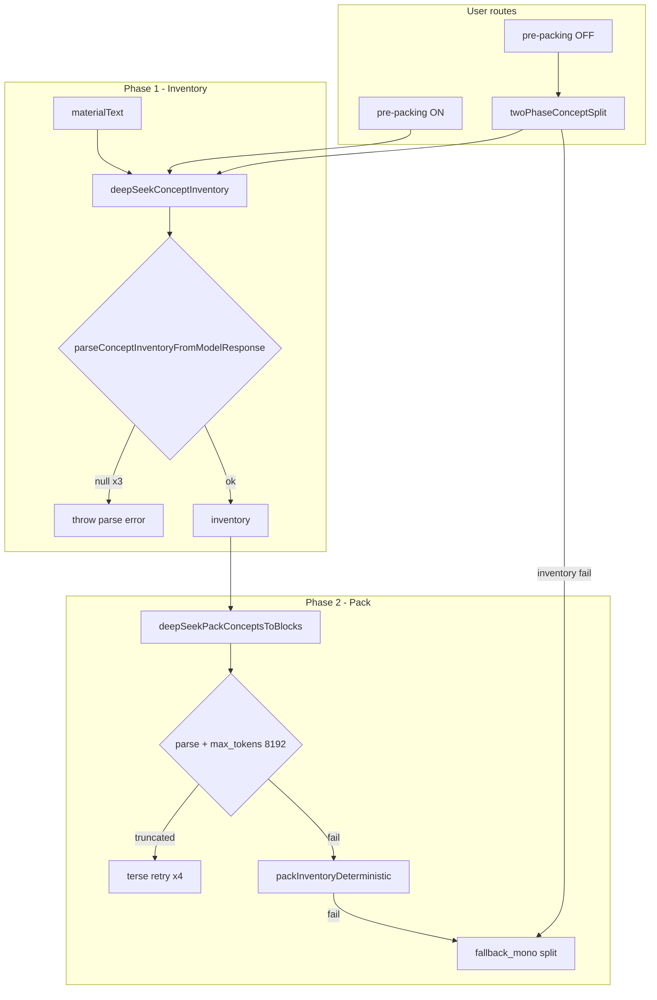

# Deep Dive — Concept inventory truncation (RSVP phase 1)

**Status**: Open (diagnosed, not fixed)  
**Reported**: 2026-06-16  
**Related**: [2026-06-11 concept pack truncation fix](./2026-06-11_concept-pack-truncation-fix.md)  
**Prior session**: [Debug concept inventory parse failure](575ba775-7f11-4063-ac1f-a60501233e4c)

---

## 1. Síntoma visible

Al generar bloques RSVP (o al pedir recomendación de bloques), la app muestra:

> **Model returned concept inventory JSON we could not parse. Please try generating blocks again.**

En consola (`api.js`):

```
Concept inventory: parse failed, trying next attempt… { "concepts": [ { "id": "c1", … "anchor_type
Concept inventory: all parse attempts failed: { "concepts": [ … "source_phrase": "Locke llega… su a
```

El JSON **empieza bien** (`concepts`, `id`, `title`, `scope_one_line`, a veces `anchor_type: "cited"`) pero **se corta a mitad de campo** — típicamente en `anchor_type` sin valor, o en `source_phrase` a mitad de palabra.

### Ruido en consola (no es la causa)

| Log | Origen | Impacto |
|-----|--------|---------|
| `127.0.0.1:7501/ingest/... ERR_CONNECTION_REFUSED` | `fetch` de depuración en `study.js` / `ui.js` (`#region agent log`) | Ninguno; servidor local inexistente |
| `Failed to load resource: 404` | Probable asset estático o mismo ingest | No relacionado con inventario |

Ver también: [deep-dives/2026-05-23_block-split-assessment-sw.md](./2026-05-23_block-split-assessment-sw.md) — ya se señaló que esos `fetch` a `:7501` son ruido en producción.

### Material del caso reportado

Texto de filosofía en español (idealismo vs. materialismo, empirismo, contrato social, Locke/Hobbes). Campos del inventario en español; la app y los prompts internos siguen en inglés (`.cursorrules`).

---

## 2. Dónde ocurre en el código

### Pipeline de dos fases (contrato)

```text
Phase 1  runConceptInventory → deepSeekConceptInventory     → ConceptInventoryItem[]
Phase 2  packInventoryToBlocks → deepSeekPackConceptsToBlocks → blocks + pack_meta
```

**Archivos clave**

| Pieza | Archivo | Función |
|-------|---------|---------|
| Llamada LLM fase 1 | `src/js/api.js` | `deepSeekConceptInventory` (~L1010–1082) |
| Parser | `src/js/api.js` | `parseConceptInventoryFromModelResponse` (~L966–1007) |
| JSON genérico | `src/js/api.js` | `parseModelJsonValue` (~L137–151) |
| Orquestación | `src/js/session.js` | `runConceptInventory` (~L2221–2279) |
| Split completo | `src/js/session.js` | `twoPhaseConceptSplit` (~L2580–2635) |
| Adapter LLM | `src/js/llm.js` | `llmChatCompletions` — `max_tokens` solo si se pasa |

**Contrato original**: `specs/20260526-block-split-dedup/contracts/two-phase-split-api.md`  
- Fase 1: 3 reintentos (full → compact → compact sin `json_object`).  
- **No documenta** `max_tokens` ni detección de truncado.  
- Dice fallback mono-fase en fallo de paso 1 o 2 — pero **no todas las rutas lo usan** (ver §5).

### Flujo de error actual

```text
deepSeekConceptInventory
  → callLlmSplit (sin max_tokens)
  → llmChatCompletions (default del proveedor)
  → respuesta truncada
  → parseModelJsonValue → null
  → parseConceptInventoryFromModelResponse → null
  → 3 intentos agotados
  → throw "Model returned concept inventory JSON we could not parse…"
```

Los `console.warn` solo muestran `lastRaw.slice(0, 400)` o `800` — el truncado real puede estar más allá, pero el patrón en el tail del log confirma JSON incompleto.

---

## 3. Causa raíz

**Truncado de tokens de salida (`max_tokens`) en la fase 1 del pipeline**, no un bug del parser ni un schema inválido del modelo.

### Evidencia

1. **Patrón de logs**: JSON válido hasta un concepto completo (`c1`) y corte en `c2` o antes en `"anchor_type` sin cerrar comilla.
2. **Asimetría pack vs inventario** (ya documentada como deuda):

   | Fase | Función | `max_tokens` | Truncación detectada | Reintentos terse |
   |------|---------|--------------|----------------------|------------------|
   | 1 Inventario | `deepSeekConceptInventory` | ❌ no | ❌ no | 3 (compact) |
   | 2 Pack | `deepSeekPackConceptsToBlocks` | ✅ `CONCEPT_PACK_MAX_TOKENS` (8192) | ✅ `looksLikeTruncatedModelJson` | 4 (incl. terse) |

3. **Fix previo explícito sobre inventario** — `deep-dives/2026-06-11_concept-pack-truncation-fix.md` §4:
   > *"El inventario sigue sin `max_tokens` elevado; PDFs enormes podrían truncar en fase 1 con el mismo síntoma."*

4. **Parser descartado como causa**: `parseConceptInventoryFromModelResponse` solo exige `id`, `title`, `scope_one_line`. Los logs muestran esos campos en `c1`. `concept_type` y `anchor_type` son opcionales.

### Por qué este documento es más denso de salida

Varias features **aumentaron el tamaño del JSON de inventario** sin subir el presupuesto de tokens:

| Feature | Efecto en salida fase 1 |
|---------|-------------------------|
| `20260613-source-fidelity` | `source_phrase` obligatorio cuando el término aparece; `anchor_type` cited/inferred |
| `20260617-pipeline-levers` | Target dinámico: `max(30, min(cap, round(wordCount/300)*2))` — hasta **120 conceptos** con `inventoryCap` |
| `twoPassInventory` (levers) | Segunda pasada por secciones si inventario < 80% del target y doc > 8000 palabras |
| Densidad del prompt | Pide distinctions, named arguments, critical examples — no solo temas mayores |

Para un PDF de filosofía denso (~15k+ palabras), el target puede ser **~100 conceptos**, cada uno con `source_phrase` (hasta 25 palabras en prompt, 200 chars al parsear), `module`, `concept_type`, `prerequisite_ids`.

Estimación burda: **~150–250 tokens por concepto** → 30–50 conceptos ya pueden acercarse al default de completion de muchos APIs; 80–120 conceptos casi seguro truncan sin `max_tokens` explícito.

---

## 4. Relación con el fix del concept pack (jun 2026)

El 11-jun se resolvió el **mismo síntoma** en fase 2 (*"Model returned concept pack JSON we could not parse"*) con:

- `CONCEPT_PACK_MAX_TOKENS = 8192` en `callLlmSplit`
- `looksLikeTruncatedModelJson` + mensaje accionable si truncado
- 4º reintento `terse: true` (summaries 1 frase, signatures ≤5 términos)
- Fallback: `packInventoryDeterministic` → si falla, `deepSeekSplitIntoBlocks` (`pipeline: "fallback_mono"`)

**Tests**: `cursor-tests/20260611_concept-pack-truncation-fix.mjs`

La fase 1 quedó **conscientemente sin el mismo tratamiento** por trade-off coste/latencia (pack genera N bloques con summaries; inventario “debería” ser más pequeño). Esa suposición **ya no se cumple** con source-fidelity + targets altos en material denso.

---

## 5. Gap arquitectónico: no todas las rutas tienen fallback

El contrato `two-phase-split-api.md` dice fallback mono-fase si falla paso 1 o 2. En código:

| Ruta | Llama | ¿Fallback si inventario falla? |
|------|-------|-------------------------------|
| Generate blocks, pre-packing **OFF** | `twoPhaseConceptSplit` | ✅ `deepSeekSplitIntoBlocks` |
| Generate blocks, pre-packing **ON** (default) | `runConceptInventory` directo | ❌ error al usuario |
| Recommend blocks | `runConceptInventory` | ❌ error al usuario |
| Ingest-only vault | `runIngestOnlyPipeline` → `runConceptInventory` | ❌ `alert` |
| Recall / hub bootstrap | `runConceptInventoryForDoc` | ❌ según caller |

`ASSESSMENT_BEFORE_PACKING: true` en `src/js/config/flags.js` → la ruta principal de “Generate blocks” **no pasa por** `twoPhaseConceptSplit` hasta después del assessment; el inventario debe completarse antes, sin red de seguridad.

Esto explica por qué el usuario ve el error **bloqueante** aunque exista fallback mono-fase en otra ruta.

---

## 6. Comparación fase 1 vs fase 2 (estado actual)



**Asimetría**: fase 2 tiene tres capas de degradación; fase 1 tiene cero.

---

## 7. Hipótesis descartadas

| Hipótesis | Por qué se descarta |
|-----------|---------------------|
| Parser demasiado estricto | `c1` en logs cumple campos mínimos; fallo es `JSON.parse` → null |
| Idioma español en salida | Prompt pide responder en `{language}`; no rompe JSON |
| `json_object` mode | Se reintenta sin él en 3er intento; mismo truncado |
| Debug ingest `:7501` | Conexión rechazada; no afecta LLM |
| Duplicados de `id` | Truncado ocurre antes de tener array parseable completo |

---

## 8. Fix propuesto (mínimo, espejo del pack)

### 8.1 Cambios en `api.js`

1. **`CONCEPT_INVENTORY_MAX_TOKENS`** (sugerido: 8192, alinear con pack; valorar 16384 si cap 120 conceptos es habitual).
2. Pasar `max_tokens` en todos los intentos de `deepSeekConceptInventory` vía `callLlmSplit`.
3. **4º intento `terse: true`** en system/user: omitir o acortar `source_phrase`, `module`, `concept_type`; solo `id`, `order`, `title`, `scope_one_line`.
4. **`looksLikeTruncatedModelJson(lastRaw)`** antes del throw:
   - Truncado: *"Model response was cut off before finishing the concept inventory. Try again, or study a shorter section."*
   - Otro: mensaje actual genérico.

### 8.2 Cambios en `session.js` / `study.js` (opcional pero recomendado)

5. **Fallback en rutas sin él**: si `runConceptInventory` falla con truncado en recommend / pre-packing, opciones:
   - Reintento automático con target reducido (`inventoryCap` temporal), o
   - Degradar a split mono-fase solo para continuar (pierde inventario compartido fino — peor para assessment/recall).

6. **Inventario parcial** (más arriesgado): si JSON truncado pero `parseModelJsonValue` pudiera extraer conceptos completos al inicio — hoy **no** se hace; requeriría parser tolerante a array truncado (frágil; el pack fix descartó reparación heurística).

### 8.3 Limpieza

7. Eliminar `fetch` a `127.0.0.1:7501` en `study.js` / `ui.js` antes de merge.

### 8.4 Tests

Nuevo `cursor-tests/20260616_concept-inventory-truncation.mjs` (espejo de pack):

- `looksLikeTruncatedModelJson` con fragmento de logs del usuario (filosofía, corte en `anchor_type`).
- Contrato: `api.js` declara `CONCEPT_INVENTORY_MAX_TOKENS` y lo pasa en `deepSeekConceptInventory`.
- `parseConceptInventoryFromModelResponse` con JSON completo de ejemplo → ok.

### 8.5 Spec / contrato

Actualizar `specs/20260526-block-split-dedup/contracts/two-phase-split-api.md`:

- Documentar `max_tokens` fase 1.
- Documentar mensaje diferenciado truncado vs schema.
- Aclarar qué rutas usan fallback cuando pre-packing está activo.

---

## 9. Workarounds para el usuario (hasta fix)

1. **Reintentar** — a veces el modelo devuelve menos conceptos y cabe en el límite (poco fiable).
2. **Acotar material** — subir una sección más corta o usar scope de jerarquía documental si está disponible.
3. **Desactivar pre-packing** temporalmente — solo si existe flag en UI/settings; permitiría `twoPhaseConceptSplit` y fallback mono-fase (pierde assessment previo al pack).
4. No confundir errores `:7501` con el fallo real.

---

## 10. Deuda técnica acumulada

| Origen | Deuda |
|--------|-------|
| Pack fix (jun 11) | Inventario sin `max_tokens`; predicho explícitamente |
| Pack fix | `looksLikeTruncatedModelJson` heurística (`length > 200`); no distingue JSON mal formado largo |
| Two-phase contract | Fallback documentado pero no unificado en todas las entradas |
| Source fidelity | Más campos por concepto → más tokens sin revisar presupuesto fase 1 |
| Pipeline levers | Target hasta 120 conceptos sin chunking de inventario |
| Pre-packing assessment | Hace inventario obligatorio y bloqueante antes del pack |
| Debug ingest | Telemetría local hardcodeada en código de producción |

**No escalaría a largo plazo**

- Cuatro reintentos LLM secuenciales en cada fallo (lento y caro).
- Inventario monolítico O(conceptos) para documentos de 100+ conceptos — hará falta inventario por módulo/chunk (map-reduce como `deepSeekConceptInventoryPhase2` pero como estrategia principal).
- Subir `max_tokens` global en `callLlmSplit` — inflaría split clásico y otras fases.

---

## 11. Preguntas de consolidación

1. ¿Por qué el pack pudo arreglarse en jun 11 y el inventario no, si el usuario puede fallar **antes** de llegar al pack?
2. Con `ASSESSMENT_BEFORE_PACKING: true`, ¿debería `runConceptInventory` compartir el mismo fallback que `twoPhaseConceptSplit`, o es preferible fallar loud para no generar assessment sobre inventario incompleto?
3. ¿Cuál es el `max_tokens` efectivo por defecto de DeepSeek/Gemini cuando no se envía el campo?
4. ¿Un inventario “terse” sin `source_phrase` degrada source-fidelity fase B lo suficiente como para forzar re-inventario en modo strict?

---

## 12. Regla sugerida para `.cursorrules`

Añadir (del pack fix, ampliado):

1. Toda llamada LLM que espera JSON estructurado **grande** debe declarar `max_tokens` explícito; constante nombrada + comentario con orden de magnitud esperado.
2. Errores post-LLM deben distinguir **truncado**, **JSON inválido**, y **validación de negocio**.
3. Si una fase tiene fallback en `twoPhaseConceptSplit`, las rutas alternativas (recommend, pre-packing, ingest, caché) deben usar el **mismo punto de degradación** o documentar por qué no.

---

## 13. Referencias cruzadas

| Artefacto | Relevancia |
|-----------|------------|
| `deep-dives/2026-06-11_concept-pack-truncation-fix.md` | Fix hermano fase 2; deuda explícita fase 1 |
| `specs/20260526-block-split-dedup/` | Pipeline dos fases, WP1 inventario |
| `specs/20260611-rsvp-block-recommend/` | Caché inventario; recommend llama fase 1 sola |
| `specs/20260616-fix-pregen-assessment/` | Assessment después de inventario; bloquea generate |
| `specs/20260613-source-fidelity/` | `source_phrase`, `anchor_type` en inventario |
| `specs/20260617-pipeline-levers/` | Target dinámico conceptos, two-pass |
| `cursor-tests/20260611_concept-pack-truncation-fix.mjs` | Plantilla de tests |
| `cursor-tests/20260526_t01-t04-two-phase-split-dedup.mjs` | Parser inventario |
| `src/js/pipeline-levers.js` | `computeEstimatedConceptTarget` |

---

## 14. Ejemplo de log truncado (anonimizado del reporte)

```json
{
  "concepts": [
    {
      "id": "c1",
      "order": 1,
      "title": "Idealismo vs. Materialismo",
      "scope_one_line": "Dos corrientes filosóficas opuestas para explicar la realidad.",
      "source_phrase": "La concepción idealista ha sido la dominante…",
      "anchor_type": "cited",
      "module": "Introducción",
      "prerequisite_ids": [],
      "concept_type": "distinction"
    },
    {
      "id": "c2",
      "order": 2,
      "title": "Empirismo y Contrato Social",
      "scope_one_line": "Crítica a Locke y Hobbes…",
      "source_phrase": "Locke llega a la idea del contrato social y no es capaz de ubicar su a
```

↑ Respuesta incompleta: sin cierre de string, objeto, array ni raíz. `JSON.parse` falla → usuario bloqueado en rutas sin fallback.
