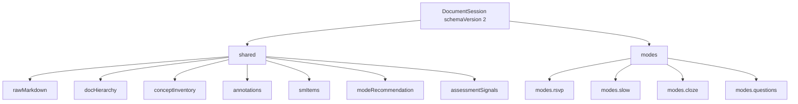
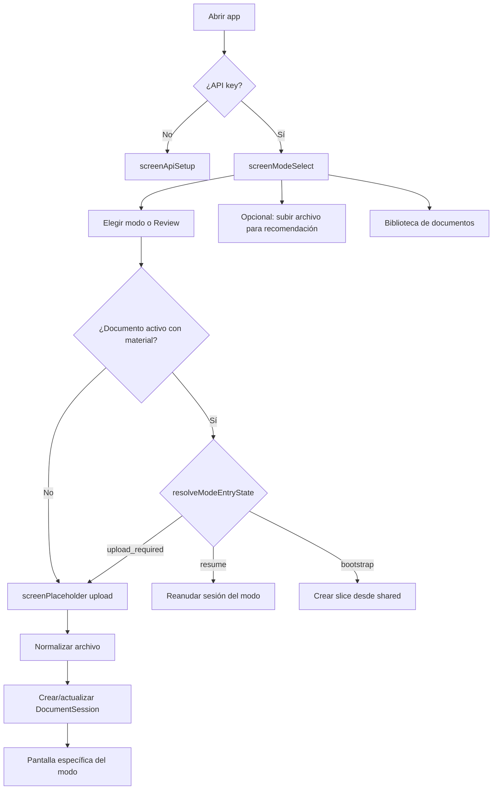
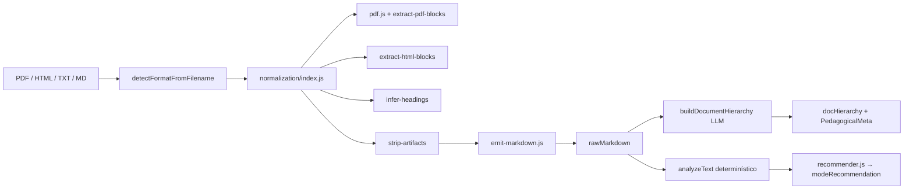
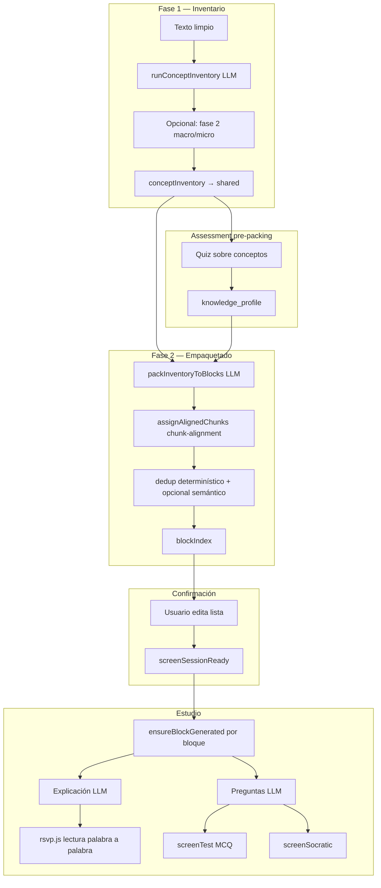
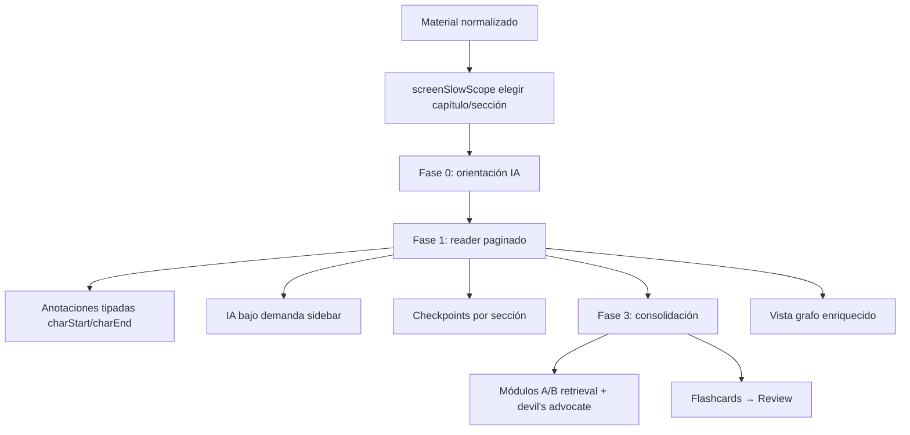
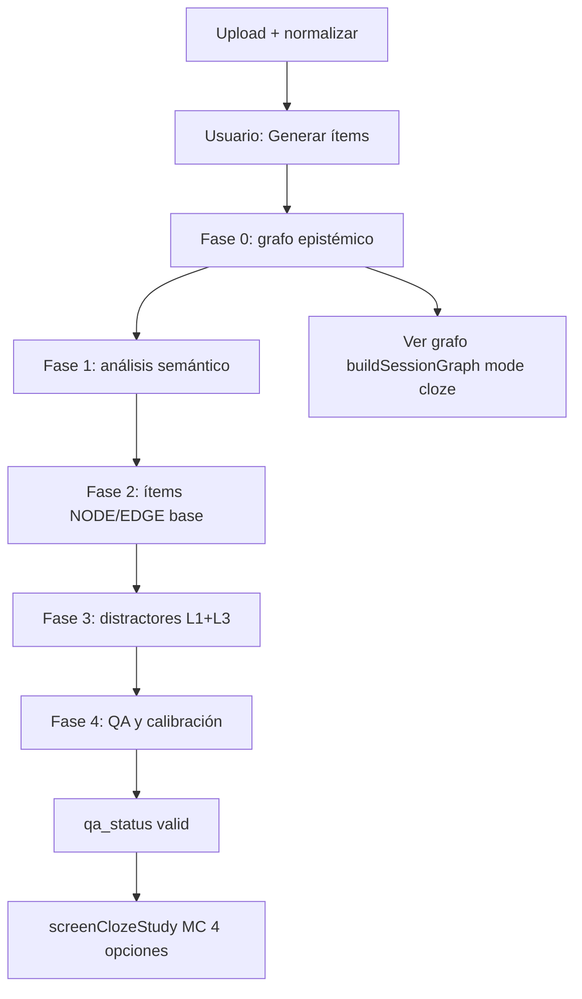
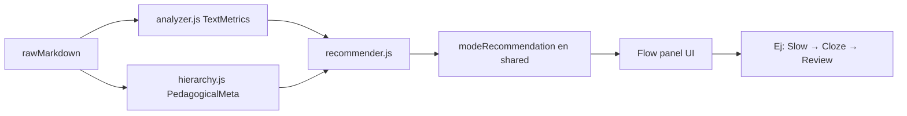
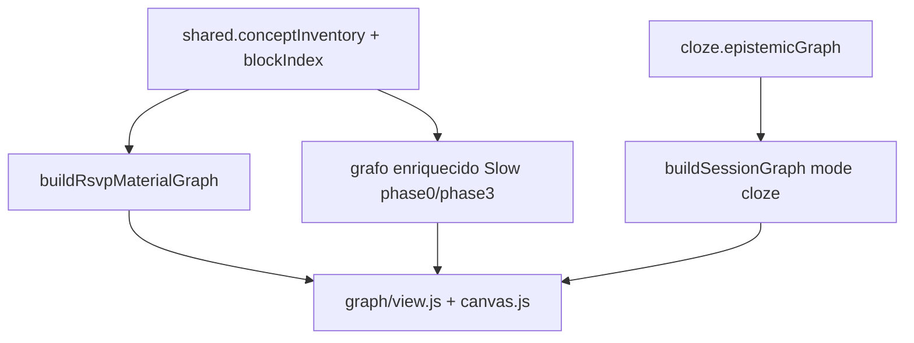
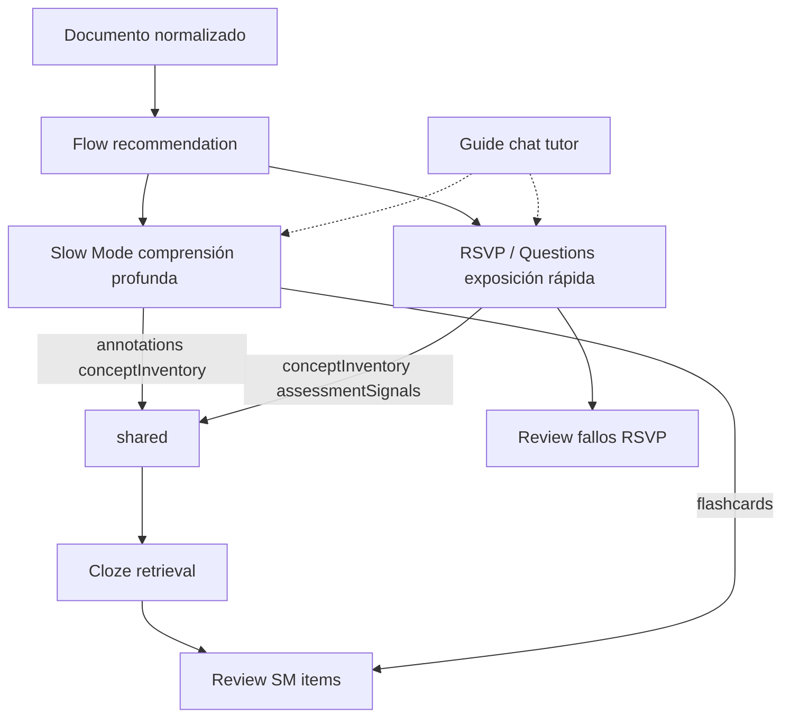

# Pith — Visión general de la aplicación

Documento de referencia para entender **qué hace la app**, **cómo fluyen los datos**, **dónde vive cada responsabilidad** y **dónde encajan nuevas funcionalidades**. Basado en el código (`src/js/`), los specs (`specs/`) y el ROADMAP activo.

---

## 1. Qué es

**Pith** es una PWA de estudio académico que convierte material (PDF, HTML, TXT, MD) en experiencias pedagógicas distintas según el tipo de texto y el objetivo del estudiante. No es un único “modo de lectura”: es una **plataforma multi-modo** sobre un **documento compartido**.

| Modo | Para qué sirve | Metáfora |
|------|----------------|----------|
| **RSVP** | Lectura rápida secuencial + preguntas por bloque | “Curso empaquetado en bloques” |
| **Questions** | Solo preguntas MCQ/Socráticas sobre bloques (sin RSVP) | “Examen por bloques” |
| **Slow Mode** | Lectura profunda paginada, anotaciones, fases 0–3 | “Lectura filosófica activa” |
| **Cloze** | Recuperación activa MC sobre grafo epistémico | “Flashcards inteligentes del documento” |
| **Review** | Repaso de fallos + flashcards (incl. desde Slow) | “Consolidación espaciada (parcial)” |

La app corre **100 % en el cliente** (navegador), persiste en **localStorage**, y usa **LLM vía API key del usuario** (DeepSeek / Gemini según configuración).

---

## 2. Stack y organización del código

```mermaid
flowchart LR
  subgraph UI
    HTML[index.html pantallas]
    CSS[src/css/*]
    UI[ui.js]
  end
  subgraph Orquestación
    MAIN[main.js boot]
    STUDY[study.js flujos]
    MODE[mode-bootstrap.js]
  end
  subgraph Datos
    STORE[session-store.js]
    SESSION[session.js]
    TYPES[session-types.js]
  end
  subgraph Dominio
    RSVP[rsvp.js]
    SLOW[slow/*]
    CLOZE[cloze/*]
    REV[review.js]
    GRAPH[graph/*]
  end
  subgraph Infra
    NORM[input-normalization.js + normalization/*]
    API[api.js prompts LLM]
    LLM[llm.js]
  end
  HTML --> MAIN
  MAIN --> STUDY
  STUDY --> STORE
  STUDY --> RSVP
  STUDY --> SLOW
  STUDY --> CLOZE
  NORM --> STUDY
  API --> LLM
  SESSION --> STORE
```

### Carpetas clave

| Ruta | Rol |
|------|-----|
| `index.html` | Todas las pantallas (`screen*`) y chrome global (sidebar tutor, PWA) |
| `src/js/main.js` | Boot, migración V1→V2, wiring global |
| `src/js/study.js` | **Orquestador principal**: upload, modos, RSVP pipeline, flow panel |
| `src/js/session-store.js` | CRUD de `DocumentSession` en localStorage |
| `src/js/session.js` | Inventario, packing, dedup, helpers RSVP |
| `src/js/api.js` | Prompts y llamadas LLM (bloques, inventario, assessment, cloze…) |
| `src/js/input-normalization.js` | Facade: archivo → markdown canónico |
| `src/js/normalization/` | Pipeline determinístico PDF/HTML/TXT → markdown |
| `src/js/recommendation/` | Análisis de texto + recomendación de flujo pedagógico |
| `src/js/slow/` | Slow Mode completo (reader, fases, anotaciones, grafo) |
| `src/js/cloze/` | Pipeline fases 0–4 + estudio MC |
| `src/js/graph/` | Construcción y visualización de grafos (RSVP / Slow / Cloze) |
| `specs/` | Especificaciones por feature (contratos, data-model, quickstart) |
| `cursor-tests/` | Tests de integración sin browser |

---

## 3. Modelo de datos: un documento, varios modos

La decisión arquitectónica central está en `specs/20260609-unified-session`: **un documento subido = una `DocumentSession`**, identificada por hash del markdown normalizado.



### Capa `shared` (cross-mode)

Lo que **cualquier modo puede leer/escribir** sin acoplarse al otro:

- `rawMarkdown` — texto canónico del documento
- `docHierarchy` — árbol de secciones (LLM + heurísticas)
- `conceptInventory` — conceptos detectados (RSVP / Slow alimentan aquí)
- `annotations` — anotaciones Slow Mode (`charStart`/`charEnd`)
- `smItems` — ítems de repetición espaciada unificados
- `modeRecommendation` — flujo sugerido (RSVP → Cloze → Review…)
- `assessmentSignals` — conceptos fallados/acertados en RSVP/Questions

### Capa `modes.*` (privada por modo)

Cada slot guarda **exactamente lo que antes vivía en `sessionsByMode[mode]`**:

- **RSVP / Questions**: `blocks`, `blockIndex`, `_meta` (grafo, coverage, pipeline levers…)
- **Slow**: fase actual, scope, phase0, reader position, gamificación
- **Cloze**: `epistemicGraph`, ítems generados, progreso de estudio

**Principio**: los modos no se llaman entre sí; se comunican vía `shared`. Cloze no importa funciones de Slow; lee `shared.annotations`.

### Persistencia

```
localStorage['pith_doc_sessions']     → DocumentSession[]
localStorage['pith_active_doc_id']    → docId activo
localStorage['pith_doc_text_{docId}'] → markdown si sesión > ~400KB
```

Migración automática al boot: `session-migration.js` (V1 → V2).

---

## 4. Flujo de entrada del usuario



### Pantallas principales (`index.html`)

| Pantalla | ID | Cuándo |
|----------|-----|--------|
| API key | `screenApiSetup` | Primera vez / cambiar key |
| Selector de modo | `screenModeSelect` | Hub principal |
| Biblioteca | `screenDocLibrary` | Documentos ya estudiados |
| Crear sesión | `screenPlaceholder` | Upload + opciones por modo |
| Assessment pre-packing | `screenPrePackingAssessment` | RSVP: quiz antes de empaquetar |
| Lista de bloques | `screenBlocksList` | Confirmar/editar bloques |
| Sesión lista | `screenSessionReady` | Empezar estudio RSVP |
| Entre bloques / RSVP / Test / Socrático | `screenBetweenBlocks`, `screenSocratic`, `screenTest` | Estudio activo RSVP |
| Slow scope / Fase 0 / Reader / Fase 3 / Grafo | `screenSlow*` | Slow Mode |
| Cloze estudio | `screenClozeStudy` | MC cloze |
| Review | `screenReview*` | Repaso |

### Continuidad entre modos

`mode-bootstrap.js` + `study.js`:

1. **`resolveModeEntryState(doc, mode)`** → `resume` | `bootstrap` | `upload_required`
2. **`enterModeWithContinuity(mode)`** — punto único de entrada a un modo
3. **`buildModeSliceFromShared`** — nuevo modo hereda markdown, jerarquía, inventario
4. **Flow panel** — recomienda secuencia y permite “continuar al siguiente paso” sin re-subir

Specs relacionados: `20260609-flow-recommendation`, `20260612-mode-continuity`.

---

## 5. Pipeline de normalización (entrada común)

Todos los modos pasan por el mismo material canónico: **markdown**.



### Qué hace cada capa

| Etapa | Módulo | LLM | Propósito |
|-------|--------|-----|-----------|
| Extracción PDF | `extract-pdf-blocks.js`, `pdf-outline.js` | No | Texto, font size, outline |
| Inferencia headings | `infer-headings.js`, `strip-artifacts.js` | No | H1–H6, quitar footers/números |
| Delimitadores ❖ ➔ | `hierarchy.js` / infer-headings | No | Apuntes con símbolos especiales |
| Emisión markdown | `emit-markdown.js` | No | Formato canónico único |
| Jerarquía documento | `hierarchy.js` | Sí (1 call) | Árbol + metadatos pedagógicos |
| Recomendación flujo | `recommendation/*` | No (usa meta LLM previo) | Qué modos en qué orden |

**Contrato**: `specs/20260532-markdown-canonical`, `20260531-structure-inference`, `20260609-doc-hierarchy-index`, `20260534-section-detection-impr`.

### Warnings típicos

- `low_heading_confidence` — scope picker puede estar incompleto
- `scanned_pdf_no_text` — PDF sin texto seleccionable

---

## 6. Modo RSVP — flujo completo

RSVP es el pipeline más complejo: **inventario → assessment opcional → empaquetado → generación lazy por bloque → estudio**.



### Sub-flujo de un bloque (`ensureBlockGenerated`)

1. Resuelve **chunk de fuente alineado** al concepto del bloque
2. Genera **explicación** (y **preguntas** en call separada — L13)
3. Valida **fidelidad a fuente** (`fidelity-validation.js`, `source-fidelity.js`)
4. Opcional: **audit overlap** con bloque anterior, **claim coverage retry**
5. Actualiza **`coverageManifest`** para bloques siguientes
6. Persiste bloque; RSVP muestra explicación; luego preguntas

### Palancas del pipeline (modo estricto)

Feature `20260617-pipeline-levers` — 25 palancas (L1–L25) en `pipeline-levers.js`, `session.js`, `api.js`, `chunk-alignment.js`:

| Palanca | Efecto resumido |
|---------|-----------------|
| L15 | Key terms / Overview / Course map → **0 preguntas** |
| L14 | Scope de preguntas por tipo de bloque |
| L18 | Anti-reteaching (términos ya preguntados) |
| L17+L23 | Audit overlap + retry |
| L16+L22 | Coverage manifest entre bloques |
| L1–L3 | Jerarquía, inventario two-pass, densidad dinámica |
| L8–L10 | Chunk alignment: snap secciones, min words, penalización términos |
| L5-D | Key terms fuera de secuencia lineal (glosario lateral) |
| L24+L25 | Nodos grises en grafo + prerequisites |

**Modo estricto** (`source_fidelity_mode: strict`) activa defaults más agresivos (dedup threshold 2, claim coverage min 0.6…).

### RSVP en pantalla

- **`rsvp.js`**: trocea explicación en chunks (texto + math), WPM, pausas de comprensión
- **`paced-reader.js`**: variante de lectura pausada
- **Sidebar “Re-read block text”**: markdown del chunk fuente
- **Guide chat** (`guide-chat.js`): tutor anclado a bloque actual + fuente

### Prefetch / zero latency

`specs/20260527-zero-latency-blocks`: mientras estudias bloque N, prefetch generación N+1 en background (`itemsPromise`, overlay de transición).

---

## 7. Modo Questions

Variante de RSVP **sin lectura RSVP**: mismos bloques y pipeline de generación, pero el estudio salta directo a preguntas MCQ/Socráticas.

- `studyMode: "questions"` en el slice
- Comparte inventario, packing, `ensureBlockGenerated`
- Las respuestas alimentan `shared.assessmentSignals` para Cloze posterior

---

## 8. Slow Mode — lectura profunda



### Fases

| Fase | Pantalla | Qué pasa |
|------|----------|----------|
| **0** | `screenSlowPhase0` | Tesis, mapa argumental, conceptos, pregunta guía (LLM; map-reduce si texto largo) |
| **1** | `screenSlowReader` | Paginación viewport (`pagination.js`), anotaciones (`annotations.js`), focus mode |
| **2** | checkpoints | Chip dismissable al fin de sección → auto-explicación |
| **3** | `screenSlowPhase3` | Revisión argumental, retrieval, integración grafo, steel-man |

### Modo crítico

Toggle al crear sesión: prioriza anotaciones `⊘`, `↯`, `⚠`, steel-manning (`⇑`), multiplicador de profundidad.

### Escritura en `shared`

Slow escribe **anotaciones** y **conceptInventory** en la capa compartida → Cloze puede saltarse fase 0 y priorizar conceptos débiles.

Spec: `specs/20260528-slow-mode`, reader desktop `20260533-slow-reader-desktop`.

---

## 9. Modo Cloze — recuperación activa



### Pipeline (`cloze/pipeline.js`)

- **Fase 0**: nodos/aristas epistémicos (CONCEPT, THESIS, TERM…)
- **Fases 2–4**: ítems `sentence_with_blank`, distractores, dificultad EASY/MEDIUM/HARD
- Si ya hay trabajo en **Slow + unified session**: fase 0 puede omitirse; usa `shared.conceptInventory` + `annotations`
- **`assessmentSignals`**: prioriza conceptos fallados en RSVP/Questions

Spec: `specs/20260529-cloze-mode`.

---

## 10. Review — consolidación

- Repasa preguntas falladas de sesión RSVP/Questions
- Modos: test MCQ, socrático, ambos
- Flashcards desde Slow Mode (`slow/phase3.js` → `review.js`)
- Pool SM-2 unificado en `shared.smItems` (integración parcial v1)

Pantallas: `screenReviewConfig` → `screenReviewGenerating` → `screenReview` → `screenReviewSummary`.

---

## 11. Recomendación de flujo pedagógico



- **No bloquea**: el usuario puede ignorar y abrir cualquier modo
- **No añade LLM extra**: reutiliza metadatos de jerarquía
- **Tracker** (`recommendation/tracker.js`): progreso por paso, override manual

Ejemplo de lógica: paper filosófico denso → Slow primero; apuntes cortos → RSVP; después Cloze para retrieval.

Spec: `specs/20260609-flow-recommendation`, panel chrome `20260610-flow-panel-chrome-polish`.

---

## 12. Fidelidad a la fuente (Source Fidelity)

Problema: el LLM “inventa” definiciones genéricas en lugar de las del profesor.

| Fase | Qué aporta |
|------|------------|
| **A** | Reglas en prompts + tutor anclado (`source-fidelity.js`) |
| **B** | Chunks alineados a conceptos (`chunk-alignment.js`), validación post-gen |
| **C** | Extract→rewrite, modo estricto UI, banner discrepancias |

Validación en `fidelity-validation.js`: overlap términos, `chunk_coverage`, `claimCoverageRatio`, retry si coverage < umbral.

Spec: `specs/20260613-source-fidelity`.

---

## 13. Sistema de grafos

Tres familias de grafo (schemas distintos, inputs compartidos):



- **RSVP**: nodos por concepto/bloque, aristas pedagógicas, nodos grey (gaps), prerequisites (L24/L25)
- **Slow**: capas list/tree, argument map editable
- **Cloze**: grafo epistémico puro

Spec grafo académico: `20260530-graph-academic-genre`.

---

## 14. LLM y configuración

| Módulo | Rol |
|--------|-----|
| `llm.js` | Abstracción DeepSeek / Gemini, API keys en localStorage |
| `api.js` | Todos los prompts (inventario, pack, bloques, assessment, cloze, slow phase0…) |
| `config/flags.js` | Feature flags (pre-packing assessment, etc.) |

**Regla del proyecto** (`.cursorrules`): prompts, heurísticas y razonamiento interno en **inglés**; UI de producto en inglés.

El usuario configura:
- API key (pantalla setup)
- Modelo LLM por sesión
- Idioma de estudio
- Opciones RSVP (WPM, preguntas de conexión, modo estricto…)

---

## 15. Export, offline y PWA

| Feature | Módulo |
|---------|--------|
| Export markdown sesión | `export.js`, `export-format.js` |
| Import/export sesión | specs `20260615-session-persistence-export` |
| Modo offline con pack precargado | `offline.js` |
| Service worker + cache bust | `sw.js`, `sw-update.js` (`SW_VERSION`) |
| Instalable PWA | `manifest.json` |

---

## 16. Mapa specs → capacidades

Tabla orientativa para saber **qué spec leer** según el área:

| Área | Specs principales |
|------|-------------------|
| Sesión unificada | `20260609-unified-session` |
| Normalización / headings | `20260531-structure-inference`, `20260532-markdown-canonical`, `20260534-section-detection-impr`, `20260609-doc-hierarchy-index` |
| RSVP core | `20260526-rsvp-reading-ux`, `20260527-zero-latency-blocks`, `20260526-block-split-dedup` |
| Assessment | `20260611-rsvp-assessment-reposition`, `20260523-assessment-informed-blocks`, `20260616-fix-pregen-assessment` |
| Recomendación bloques N | `20260611-rsvp-block-recommend` |
| Pipeline levers / overlap | `20260617-pipeline-levers`, `20260614-rsvp-overlap-guard` |
| Source fidelity | `20260613-source-fidelity` |
| Slow Mode | `20260528-slow-mode`, `20260533-slow-reader-desktop` |
| Cloze | `20260529-cloze-mode` |
| Flow recommendation | `20260609-flow-recommendation`, `20260610-flow-panel-chrome-polish` |
| Continuidad modos | `20260612-mode-continuity` |
| Grafo | `20260530-graph-academic-genre` |
| LLM provider | `20260525-llm-provider-selector` |

---

## 17. Dónde meter cosas nuevas (guía de extensión)

### ¿Afecta a todos los modos?

→ **`shared`** + `session-store.js` + migración si cambia schema  
→ Normalización: `input-normalization.js` / `normalization/*`  
→ Recomendación: `recommendation/recommender.js`

### ¿Solo RSVP / Questions?

→ `study.js` (orquestación), `session.js` (pack/dedup), `api.js` (prompts)  
→ Palancas: `pipeline-levers.js`, `coverage-manifest.js`, `chunk-alignment.js`  
→ Generación lazy: `ensureBlockGenerated`, `block-store.js`

### ¿Solo Slow?

→ `src/js/slow/*` — reader, annotations, phase0/3, gamification  
→ Escribir siempre en `shared` si otros modos deben verlo

### ¿Solo Cloze?

→ `cloze/pipeline.js`, `cloze/study.js`, `cloze/normalize.js`  
→ Leer `shared.assessmentSignals` para priorización

### ¿Nuevo modo de estudio?

1. Añadir slot en `session-types.js` (`MODE_KEYS`)
2. `normalizeStudyMode` + pantallas en `index.html`
3. `mode-bootstrap.js`: `isSliceResumable`, `buildModeSliceFromShared`
4. `study.js`: rama en `enterModeWithContinuity` + resume handler
5. Entrada en `recommender.js` si debe aparecer en flujo sugerido
6. Spec nuevo en `specs/`

### ¿Nueva llamada LLM?

→ Casi siempre **`api.js`** (prompt) + caller en `study.js` o módulo de modo  
→ Tests en `cursor-tests/` sin LLM live (mocks de funciones puras)

### ¿Nueva UI global?

→ `index.html` + `ui.js` + CSS en `src/css/`  
→ Bump `SW_VERSION` si tocas JS/CSS/HTML

---

## 18. Diagrama de dependencias entre modos (visión producto)



**Ideal pedagógico sugerido por la app** (no impuesto):

1. Texto denso/argumentativo → **Slow** (entender)
2. Exposición estructurada → **RSVP** (recorrido + preguntas)
3. Consolidación → **Cloze** (retrieval)
4. Mantenimiento → **Review**

---

## 19. Testing y calidad

- **`cursor-tests/*.mjs`**: tests headless importando módulos ES
- **`/validate`** (skill del proyecto): suite antes de cerrar tareas ROADMAP
- Quickstart por feature en `specs/*/quickstart.md`

---

## 20. Glosario rápido

| Término | Significado |
|---------|-------------|
| **blockIndex** | Lista de bloques de estudio (título, concept_ids, chunk alineado) — puede ser subconjunto del inventario |
| **conceptInventory** | Todos los conceptos detectados en el documento |
| **knowledge_profile** | Qué conceptos domina el usuario (post assessment) |
| **coverageManifest** | Claims ya cubiertos en bloques anteriores (anti-overlap) |
| **chunk alignment** | Asignar trozo de fuente correcto a cada bloque |
| **DocumentSession** | Unidad de persistencia: documento + shared + modes |
| **pipeline levers** | Flags/reglas L1–L25 para calidad en modo estricto |

---

## 21. Próximos pasos sugeridos para usar este documento

1. **Priorizar features**: cruzar sección 16 con tu ROADMAP activo (`ROADMAP.md` apunta ahora a pipeline-levers, ya completado).
2. **Decidir capa**: usar sección 17 antes de tocar código — ¿shared, modo, o normalización?
3. **Presentación**: secciones 1, 3, 6 y 18 sirven como narrativa de producto; los diagramas mermaid renderizan en GitHub, Obsidian o VS Code.
4. **Profundizar**: cada fila de la tabla 16 enlaza a un spec con contratos en `specs/*/contracts/`.

---

*Generado a partir del estado del repositorio (junio 2026). Si añades un modo o cambias el schema de sesión, actualiza este documento y el spec `20260609-unified-session`.*
