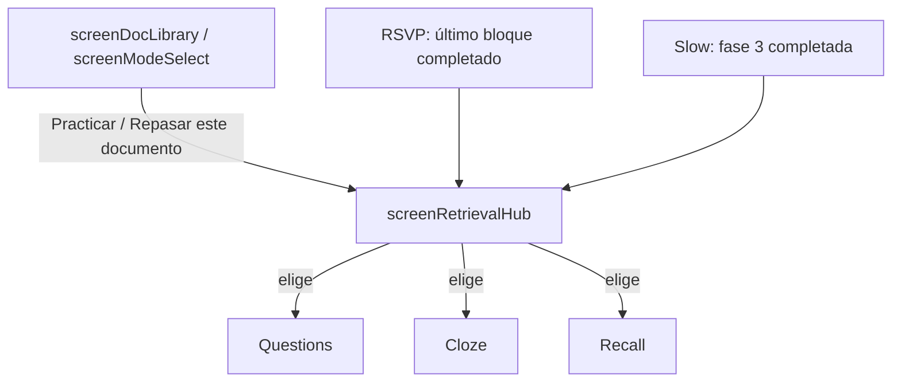
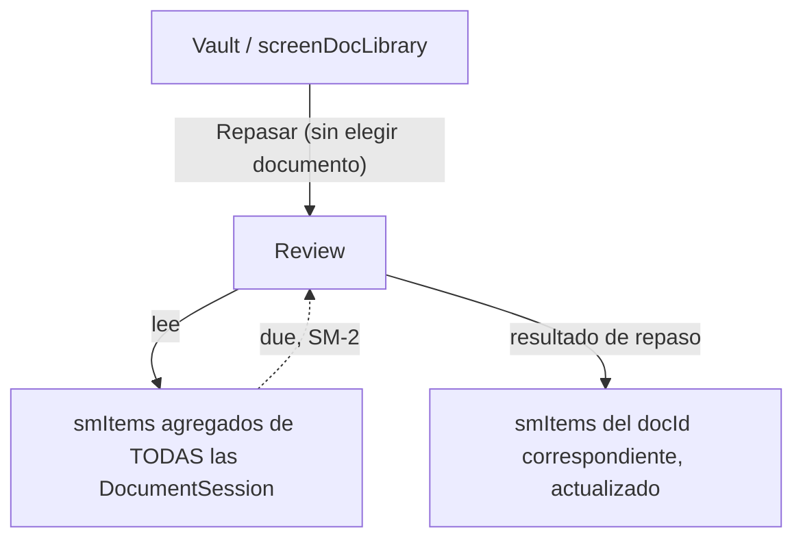

# Spec: Exposure / Retrieval Architecture & Retrieval Hub

**Fecha**: 2026-06-14
**Estado**: Draft — pendiente de revisión antes de implementación
**Relacionado**: `20260609-unified-session`, `20260609-flow-recommendation`, `20260612-mode-continuity`, `20260613-recall-mode`, `20260523-assessment-informed-blocks`

---

## 1. Resumen / Motivación

Hoy todos los modos (`rsvp`, `slow`, `cloze`, `questions`, `recall`, `review`) son slots peer en `MODE_KEYS`, cada uno con su propio ciclo de entrada/salida gestionado por `mode-bootstrap.js` + `study.js`. Esto esconde dos distinciones que sí existen a nivel pedagógico y de datos, pero no a nivel de arquitectura:

1. **Exposure vs Retrieval** — RSVP y Slow *introducen* contenido nuevo y escriben en `shared` (`conceptInventory`, `docHierarchy`, `blockIndex`, `annotations`, `epistemicGraph` parcial). Questions, Cloze y Recall *consumen* esa información y escriben señales de evaluación (`assessmentSignals`, `smItems`). Hoy, al terminar un modo exposure (último bloque de RSVP, fase 3 de Slow), el usuario es empujado por defecto hacia `Review`, sin posibilidad real de elegir entre los modos retrieval disponibles.

2. **Document vs Vault** — `Review` se modela como un modo más de `DocumentSession` (`modes.review`, pantallas `screenReviewConfig` → `screenReviewSummary`), pero su sustrato real (`shared.smItems`, vencimientos SM-2) es **transversal a todos los documentos**. Pedagógicamente, "repasar" no es una acción que se haga *sobre un documento concreto*: es una acción de vault — "¿qué tengo pendiente hoy, venga de donde venga?".

Este spec propone:

- Formalizar la taxonomía **exposure / retrieval** como propiedad de cada modo.
- Introducir un **Retrieval Hub** por documento: pantalla neutral que ofrece `Questions`, `Cloze` y `Recall`, siempre disponible (con o sin exposure previo) y también como transición natural al terminar un modo exposure.
- Sacar `Review` de `MODE_KEYS` y reposicionarlo como entrada de **nivel vault**, que agrega `shared.smItems` de todas las `DocumentSession`.

Lo que **no** cambia: el flujo embebido de RSVP (explicación de bloque → test/socrático de bloque → siguiente bloque) se mantiene exactamente igual. Este spec actúa solo en los puntos de decisión "¿y ahora qué?" — final de exposure y entrada desde la biblioteca.

---

## 2. Taxonomía de modos

Dos ejes ortogonales: **role** (qué hace con `shared`) y **scope** (a qué unidad pertenece).

| Modo | Role | Scope | Lee de `shared` | Escribe en `shared` |
|---|---|---|---|---|
| `rsvp` | exposure | document | — | `conceptInventory`, `docHierarchy`, `blockIndex`, `assessmentSignals` (del test/socrático embebido) |
| `slow` | exposure | document | — | `conceptInventory`, `annotations`, grafo enriquecido |
| `questions` | retrieval | document | `conceptInventory`, `blockIndex`, `assessmentSignals` | `assessmentSignals`, `smItems` |
| `cloze` | retrieval | document | `conceptInventory`, `annotations`, `assessmentSignals` | `epistemicGraph`, `smItems` |
| `recall` | retrieval | document | `conceptInventory`, `docHierarchy`, `assessmentSignals` | `assessmentSignals`, `smItems` |
| `review` | retrieval (scheduling) | **vault** | `smItems` de **todas** las `DocumentSession` | `smItems` (resultado de repaso) |

Notas:

- El embebido test/socrático dentro de RSVP **no cambia de categoría** — sigue siendo parte del modo `rsvp` (exposure), simplemente con un sub-paso de retrieval inmediato por bloque. Este spec no toca ese sub-flujo.
- `recall` cubre lo que en conversaciones previas se llamó "vaciado" / "Questions socrático cross-bloque" — preguntas de síntesis/relación/argumentación a nivel sección o documento (`specs/20260613-recall-mode`).
- `review` deja de tener slot en `modes.*` de un documento individual (ver §4).

---

## 3. Retrieval Hub (por documento)

### 3.1 Qué es

Una pantalla nueva, `screenRetrievalHub`, que presenta **tres opciones neutrales** — `Questions`, `Cloze`, `Recall` — sin orden de prioridad ni badges de recomendación. El usuario elige libremente.

### 3.2 Cuándo aparece



Dos entradas, siempre llevan al mismo hub:

1. **Entrada "fría"**: desde la biblioteca/selector de modo, para cualquier documento, **con o sin exposure previo**. Si no hay `conceptInventory`/`blockIndex`/`epistemicGraph`, el modo elegido ejecuta su pipeline de inventario desde cero (patrón ya existente en Cloze/Recall — "isomorfismo": reutiliza si existe, genera si no).
2. **Entrada "caliente"**: al completar un modo exposure (`rsvp` o `slow`) para ese documento. Sustituye a la pantalla de cierre actual que hoy empuja hacia Review.

No hay distinción de copy ni de lógica entre entrada fría/caliente — es la misma pantalla, simplemente con más contexto disponible en `shared` en el caso caliente.

### 3.3 Comportamiento de cada opción

| Opción | Si NO hay datos previos | Si SÍ hay datos previos (`shared`) |
|---|---|---|
| **Questions** | Genera `blockIndex` desde `conceptInventory` (pipeline RSVP sin fase de lectura) | Reutiliza `blockIndex`; si `assessmentSignals` marca conceptos fallados/débiles de una exposure reciente, esos bloques se priorizan/targetizan primero |
| **Cloze** | Dispara fase 0–4 (`cloze/pipeline.js`) de forma transparente al seleccionar — sin pantalla intermedia de "generar" | Reutiliza `epistemicGraph`/`conceptInventory`/`annotations`; `assessmentSignals` prioriza distractores/ítems sobre conceptos débiles (comportamiento ya existente, se generaliza como regla del hub) |
| **Recall** | Ejecuta inventario fresco (mismo patrón que hoy) | Reutiliza `conceptInventory`/`docHierarchy`; genera preguntas `synthesis`/`relational`/`argumentative`/`applicative` con foco en conceptos de `assessmentSignals` si existen |

Cloze aparece **siempre visible e igual que las demás** — nunca deshabilitado ni con un estado "sin generar" aparte. La generación es un detalle de implementación interno a la opción, no un paso adicional en la UI del hub.

### 3.4 Targeting por señales de exposure (`assessmentSignals` y más allá)

`shared.assessmentSignals` (conceptos fallados/acertados durante RSVP/Questions) ya existe y hoy solo lo lee Cloze. Este spec generaliza su uso: **cualquier** opción del hub entrada desde un documento con exposure reciente debe poder leer `assessmentSignals` para priorizar qué preguntar primero.

**Extensión futura (no bloqueante para v1)**: durante exposure, el usuario interactúa con el guide-chat (RSVP) o la IA bajo demanda (Slow) planteando dudas espontáneas. Hoy esas conversaciones son efímeras (sidebar, no persistidas estructuralmente). Si se capturaran como `shared.exposureSignals` — por ejemplo `{ concept_id, question_text, source: "guide-chat" | "slow-sidebar", timestamp }` — las opciones del hub podrían targetizar también esas dudas concretas, no solo aciertos/fallos de assessment.

Esto requiere instrumentar `guide-chat.js` y la IA bajo demanda de Slow para escribir en `shared`, lo cual es un cambio en módulos hoy no tocados por la capa `shared`. Se deja como **spec derivado** (`exposure-signals-capture`, ver §7) para no inflar el alcance de este documento. El modelo de datos de este spec debe simplemente **dejar hueco** para esa clave sin forzar su implementación ahora.

---

## 4. Review pasa a nivel vault

### 4.1 Estado actual

`Review` vive como `modes.review` dentro de cada `DocumentSession`, con pantallas `screenReviewConfig → screenReviewGenerating → screenReview → screenReviewSummary`, accesible desde el selector de modo de un documento concreto. Repasa fallos de RSVP/Questions de **ese documento** y flashcards de Slow de **ese documento**.

### 4.2 Propuesta

`Review` deja de pertenecer a un documento. Pasa a ser una entrada de nivel **vault**, accesible desde `screenDocLibrary`/`screenModeSelect` **sin elegir documento primero** (ej. una card "Repasar" junto a la biblioteca de documentos).

Su fuente de datos es la agregación de `shared.smItems` de **todas** las `DocumentSession` en `mylearning_doc_sessions`, filtrados por vencimiento SM-2 (due date). Cada `smItem` ya debería llevar referencia a su `docId` de origen (a verificar en `session-types.js` — si no la lleva, es un campo a añadir, no un cambio de fondo).



Las pantallas `screenReviewConfig → ... → screenReviewSummary` probablemente se mantienen casi igual en su UI — lo que cambia es **de dónde vienen los datos** (query cross-session en vez de `modes.review` de un único documento) y **dónde se entra** (vault, no dentro de un documento).

### 4.3 Punto a verificar en implementación

Si durante un repaso el usuario está "dentro" del contexto de un documento distinto al que originó el `smItem` que está repasando, hay que decidir si eso implica cambiar `mylearning_active_doc_id` o si `Review` puede leer/escribir en `shared.smItems` de cualquier `DocumentSession` sin tocar el documento activo. Esto toca `session-store.js`, que es justo el módulo identificado como punto único de cambio para la migración a Supabase — vale la pena resolver este punto **junto con** esa migración en vez de antes, para no duplicar trabajo en `session-store.js`.

---

## 5. Cambios en el modelo de datos

### 5.1 `MODE_KEYS` / `session-types.js`

- `review` deja de ser un slot de `modes.*` por documento. Las dos opciones a decidir en implementación (no bloqueantes para este spec):
  - (a) Eliminar `review` de `MODE_KEYS` por completo; `smItems` ya vive en `shared` y es suficiente.
  - (b) Mantener `modes.review` como contenedor legacy vacío por compatibilidad con `session-migration.js`, sin exponerlo en ninguna UI.
- Ninguna de las dos requiere tocar `rsvp`, `slow`, `cloze`, `questions`, `recall`.

### 5.2 Nueva propiedad declarativa por modo

Se propone añadir, junto a `MODE_KEYS`, una tabla de metadatos estática (no afecta `DocumentSession`, solo código):

```js
// Ilustrativo — nombres exactos a decidir en implementación
const MODE_TAXONOMY = {
  rsvp:      { role: "exposure", scope: "document" },
  slow:      { role: "exposure", scope: "document" },
  questions: { role: "retrieval", scope: "document" },
  cloze:     { role: "retrieval", scope: "document" },
  recall:    { role: "retrieval", scope: "document" },
};
// review: scope "vault", gestionado fuera de MODE_KEYS
```

Esto permite que `screenRetrievalHub` se construya iterando `MODE_TAXONOMY` filtrando `role === "retrieval" && scope === "document"`, en vez de hardcodear la lista de tres modos — si en el futuro se añade un cuarto modo retrieval, el hub lo recoge automáticamente.

### 5.3 `shared` — claves existentes reutilizadas, ninguna nueva obligatoria

- `conceptInventory`, `docHierarchy`, `blockIndex`, `annotations`, `epistemicGraph`, `assessmentSignals`, `smItems` — sin cambios de forma, solo nuevos lectores (Questions/Recall leyendo `assessmentSignals`, que hoy solo lee Cloze).
- `exposureSignals` (opcional, futuro, ver §3.4) — se documenta su forma propuesta para no chocar con un spec derivado, pero **no se implementa en este spec**.

### 5.4 Migración

Dado que el cambio principal es de **navegación/UI** (qué pantalla sigue a qué) y de **dónde vive `Review`**, no debería requerir bump de `schemaVersion` si se opta por la variante (b) de §5.1 (mantener `modes.review` vacío). Si se opta por (a) (eliminar la clave), `session-migration.js` necesita un paso que limpie `modes.review` de sesiones V2 existentes — trivial, pero a documentar como parte del quickstart de implementación.

---

## 6. Fuera de alcance

- El flujo embebido test/socrático dentro de RSVP (sin cambios).
- Las 25 palancas del pipeline (`pipeline-levers.js`, L1–L25).
- El flow panel / `recommender.js` — podría en el futuro sugerir qué opción del hub elegir, pero el hub en sí es **neutral por decisión explícita** (§3.1); cualquier capa de recomendación sobre el hub es un spec aparte.
- Captura de `exposureSignals` desde guide-chat / IA bajo demanda de Slow — spec derivado, ver §7.

---

## 7. Specs derivados / próximos pasos

1. **`exposure-signals-capture`** — instrumentar `guide-chat.js` (RSVP) y la IA bajo demanda de Slow para escribir dudas/preguntas espontáneas en `shared.exposureSignals`, y definir cómo las consumen Questions/Cloze/Recall desde el hub.
2. **Quickstart de implementación de este spec** — una vez aprobado, detallar:
   - Nueva pantalla `screenRetrievalHub` (HTML + wiring en `study.js`)
   - Punto de entrada desde `screenDocLibrary`/`screenModeSelect` (documento) y nueva entrada vault para Review
   - Generalización de lectura de `assessmentSignals` en Questions y Recall
   - Decisión (a) vs (b) de §5.1 y, si aplica, paso de `session-migration.js`
3. Revisar si esto debe preceder o ir en paralelo con la implementación de `20260613-recall-mode` — Recall, al ser uno de los tres habitantes del hub, debería nacer ya consciente de esta arquitectura (lectura de `assessmentSignals`, comportamiento "frío/caliente" transparente vía el hub en lugar de lógica propia).

---

*Este documento es un spec de arquitectura/diseño. No incluye contratos de función ni quickstart de implementación — esos se redactan tras revisión de esta propuesta.*
