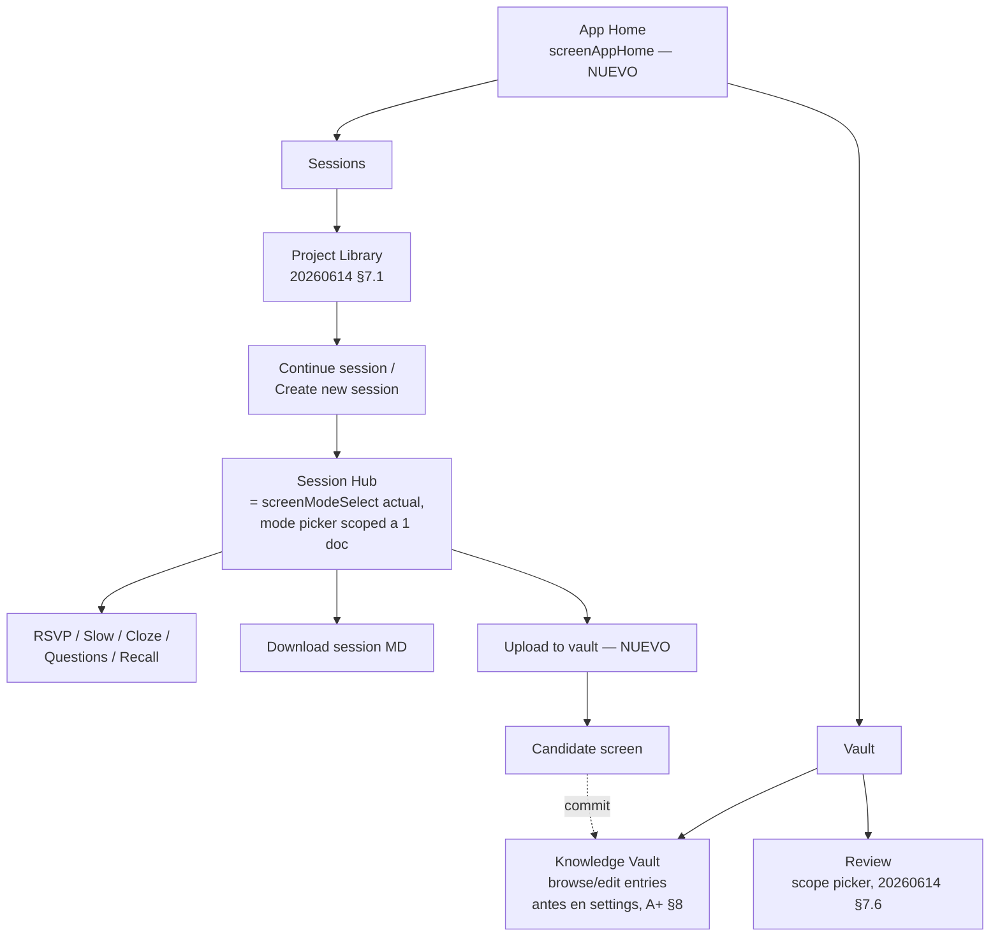

# Knowledge Vault Curation — Navigation, Facets, Upload & Review Loop

**Spec:** `20260614-knowledge-vault-curation`
**Estado:** Ready to implement
**Dependencias:** `20260613-knowledge-vault-a-plus`, `20260613-recall-mode`, `20260614-study-projects`
**Supersede:** `20260614-study-projects` §7.3 (home hub) — ver §1.1

---

## 1. Qué es y por qué

Cierra el loop bidireccional entre nivel 1 (sesión de documento) y nivel 3 (Global Knowledge Vault, GKV):

- **Sesión → Vault**: el usuario puede curar manualmente definiciones y preguntas de repaso a partir de lo que ha estudiado (`Upload to vault`).
- **Vault → Sesión** (vía Review): las respuestas en Review alimentan `mastery` y reinician el reloj de decaimiento, cerrando el ciclo que A+ dejó abierto.

También resuelve una pregunta de diseño pendiente: si un concepto debe medirse con una única pregunta o con varias "facetas" (synthesis/relational/argumentative/applicative/cloze — la taxonomía ya existente de Recall).

### 1.1 Navegación — supersede `20260614-study-projects` §7.3

La propuesta anterior (home hub con tres botones Continue/Library/Review colgando de `screenModeSelect`) se sustituye por una **bifurcación explícita en el primer nivel de navegación**, que separa "trabajar a nivel vault" de "trabajar a nivel sesión":



Cambios concretos respecto al estado actual / a 20260614:

- **`screenAppHome`** (nuevo): primera pantalla tras `screenApiSetup`. Dos acciones: `Vault` y `Sessions`. Reemplaza el punto de entrada que hoy describe `application-overview.md` §4 (`C --> D[Elegir modo o Review]`).
- **`screenModeSelect`** deja de ser home hub (revierte la propuesta de 20260614 §7.3) y vuelve a ser puramente el **Session Hub**: mode picker para un documento concreto, alcanzado siempre desde Library. Gana dos botones nuevos.
- **Knowledge Vault** (A+ §8) se promueve de "sección en settings" a rama de primer nivel bajo `Vault`. Sigue siendo de solo lectura más allá de lo que este spec añade (la edición masiva de entradas sigue siendo Post-A+ Bloque 1, fuera de alcance — ver §8).

---

## 2. Data model

### 2.1 `ConceptFacet` (reutiliza taxonomía de Recall)

```typescript
type ConceptFacet = 'synthesis' | 'relational' | 'argumentative' | 'applicative' | 'cloze';
```

Mismos valores que los tipos de pregunta de `20260613-recall-mode`. Sin taxonomía nueva.

### 2.2 `KnowledgeVaultEntry` — extensión de A+

```typescript
interface KnowledgeVaultEntry {
  // ...campos de A+ sin cambios: id, canonicalTitle, aliases, topic,
  //    mastery, masteryBase, masteryLastUpdated, lastSeen,
  //    sources, prerequisites, dependents, observations...

  definitions: VaultDefinition[];                    // NUEVO
  facetCoverage: Partial<Record<ConceptFacet, number>>; // NUEVO — facet -> timestamp última observación de ese facet
}
```

`facetCoverage` es **metadata, no un mastery paralelo**: solo dice "cuándo se observó por última vez esta perspectiva". Se actualiza al revisar (§5.2), no al crear un `VaultReviewItem`.

### 2.3 `VaultDefinition`

```typescript
interface VaultDefinition {
  text: string;          // markdown, en los términos del propio material fuente del usuario
  sourceDocId: string;
  sourceChunk?: string;  // referencia al chunk alineado (source-fidelity)
  addedAt: number;
}
```

Array porque varios documentos pueden aportar su propia formulación del mismo concepto (útil cuando dos profesores definen "lo mismo" distinto).

### 2.4 `VaultReviewItem`

```typescript
interface VaultReviewItem {
  id: string;
  vaultEntryId: string;
  facet: ConceptFacet;
  prompt: string;
  answer: string;
  sourceDocId: string;
  sm2: { interval: number; easeFactor: number; dueDate: number; repetitions: number };
  createdAt: number;
}
```

**Cardinalidad**: 0..N por `KnowledgeVaultEntry`, cada uno con su propio `facet` y su propio estado SM-2. No hay restricción de "un facet, un item" — pueden coexistir varios items del mismo facet si el usuario los añade en sesiones distintas (el LLM evita duplicados obvios en el momento de sugerir, ver §4.2, pero no se bloquea a nivel de schema).

### 2.5 `VaultObservation` — extensión de A+

```typescript
interface VaultObservation {
  // ...campos existentes (type, rawSignal, timestamp, docId)...
  facet?: ConceptFacet;  // NUEVO, opcional — metadata, no afecta el cálculo de mastery
}

type ObservationType =
  | /* ...tipos existentes de A+... */
  | 'review_correct'   // NUEVO
  | 'review_partial'   // NUEVO
  | 'review_wrong';    // NUEVO
```

### 2.6 `GlobalKnowledgeVault` — bump a schemaVersion 2

```typescript
interface GlobalKnowledgeVault {
  schemaVersion: 2;             // bump desde 1 (A+)
  entries: KnowledgeVaultEntry[];
  reviewItems: VaultReviewItem[]; // NUEVO
  lastUpdated: number;
}
```

**Migración 1→2**: `reviewItems: []`; cada `entry` existente recibe `definitions: []`, `facetCoverage: {}`. Aditivo, sin pérdida de datos.

---

## 3. Por qué mastery sigue siendo un escalar (rationale)

Tu pregunta original era si cada concepto necesita un estado único o varios por faceta. La respuesta corta: **(A) sí a varios items de repaso por faceta, (B) no a un mastery por faceta** — y son preguntas independientes.

- **(A) Varios `VaultReviewItem` por concepto, cada uno con su SM-2** — barato, y es justo lo que pides: "relational" puede estar en intervalo de 2 días porque se falló recientemente mientras "applicative" está en 30 días. SM-2 per-item ya es decaimiento per-item por diseño.
- **(B) Mastery por faceta** — repite el problema de sparsity que descartó BKT en A+: partir 3-8 observaciones/concepto en 4-5 facetas deja ~1 observación/faceta, insuficiente para que un número por faceta sea mejor que ruido.

`mastery` sigue calculándose exactamente como en A+ (media ponderada + decay), alimentado por **todas** las observaciones sin importar su `facet`. `facetCoverage` da contexto cualitativo ("relational understanding not verified recently") sin pretender ser una medida cuantitativa independiente.

---

## 4. Flujo "Upload to vault"

### 4.1 Trigger y conjunto candidato

Botón en Session Hub. Conjunto candidato = **conceptos efectivamente estudiados en esta sesión** (no todo `conceptInventory`), unión sobre los modos usados:

```javascript
function getStudiedConcepts(session) {
  const touchedIds = new Set();

  // RSVP / Questions
  for (const block of session.modes.rsvp?.blockIndex ?? session.modes.questions?.blockIndex ?? []) {
    (block.concept_ids ?? []).forEach(id => touchedIds.add(id));
  }

  // Señales de assessment (cualquier modo)
  for (const sig of session.shared.assessmentSignals ?? []) {
    touchedIds.add(sig.conceptId);
  }

  // Cloze: ítems con progreso de estudio
  for (const item of session.modes.cloze?.items ?? []) {
    if (item.studyProgress) touchedIds.add(item.concept_id);
  }

  // Recall: conceptos cubiertos por preguntas respondidas
  for (const q of session.modes.recall?.questions ?? []) {
    if (q.answered) touchedIds.add(q.concept_id);
  }

  return session.shared.conceptInventory.filter(c => touchedIds.has(c.id));
}
```

(Nombres de campos por modo a ajustar al schema real — el contrato es "unión de `concept_id`s con los que el usuario interactuó", no toda la lista de conceptos del documento.)

### 4.2 Llamada LLM batch — `extractVaultCandidates()`

Una sola llamada para todos los conceptos candidatos. Para cada concepto, si ya existe `KnowledgeVaultEntry` matched (normalización A+ por `docTopics`), se incluye:

- `existingFacets`: facets que ya tienen un `VaultReviewItem` para esa entry (independientemente de si se han revisado)
- `facetCoverage` actual

```
For each concept, given its source chunk (and existing vault context if any):

- definition: in the source material's own terms/notation (source fidelity rules apply)
- suggestedReviewItems: 0-3 items, each with a distinct `facet` from
  ['synthesis','relational','argumentative','applicative','cloze'].
  Prioritize facets NOT in existingFacets. If existingFacets already covers
  most facets, suggest fewer or none.
```

Respuesta JSON por concepto: `{ definition, suggestedReviewItems: [{ facet, prompt, answer }] }`.

Coste: 1 llamada LLM por acción "Upload to vault", acotada a los conceptos estudiados de esta sesión — mismo orden de magnitud que otras llamadas batch existentes (packing, inventario).

### 4.3 Candidate screen

Pantalla nueva (`screenUploadToVaultCandidates`):

- Lista de conceptos candidatos. Por concepto:
  - `definition` pre-rellenada, editable (textarea markdown)
  - 0-N `suggestedReviewItems`, cada uno como card con: badge de `facet`, `prompt` y `answer` editables, checkbox de selección
- Acciones: `Add selected to vault` (commit), `Cancel`
- Selección por defecto: definición marcada si el concepto no tiene `definitions` previas de este `docId`; items de repaso desmarcados por defecto (curación explícita, no automática)

### 4.4 Commit

```
Para cada concepto aceptado:
  1. normalizeConceptsToVault() — reutiliza A+ (merge/alias/new) → vaultEntryId
  2. Si definición aceptada y no hay definitions[] de este sourceDocId:
       append VaultDefinition { text, sourceDocId, sourceChunk, addedAt: now }
  3. Para cada suggestedReviewItem aceptado:
       append VaultReviewItem {
         id: uuid(), vaultEntryId, facet, prompt, answer, sourceDocId,
         sm2: { interval: 0, easeFactor: 2.5, repetitions: 0, dueDate: now },
         createdAt: now
       }
persistVault()
```

`dueDate: now` → el item está disponible para repaso desde la próxima sesión de Review, sin esperar.

**Idempotencia**: re-ejecutar "Upload to vault" sobre la misma sesión no duplica definiciones de la misma fuente (paso 2 lo evita); sí puede generar nuevos `suggestedReviewItems` si `existingFacets` ha cambiado mientras tanto (p.ej. tras editar manualmente en Knowledge Vault).

---

## 5. Review → decaimiento (cerrando el loop)

### 5.1 Nuevas observaciones

Al responder un `VaultReviewItem` (o un `smItem` ligado a un concepto del vault) en Review:

| `ObservationType` | `rawSignal` |
|---|---|
| `review_correct` | +1.0 |
| `review_partial` | +0.3 |
| `review_wrong` | -0.5 |

Se añade `VaultObservation { type, rawSignal, timestamp: now, docId: sourceDocId, facet }` a la `KnowledgeVaultEntry`. Mismos pesos relativos que A+ (cloze_correct=+1.0, mcq_wrong=-0.3, etc.) — `review_wrong` se pondera algo más negativo que `mcq_wrong` porque un item curado por el usuario representa mayor esfuerzo de recall.

### 5.2 Recalculo de mastery y reinicio de decaimiento

```
masteryBase = applyObservations(entry.observations)   // fórmula sin cambios, A+
masteryLastUpdated = now
facetCoverage[observation.facet] = now   // si la observación trae facet
```

El reinicio de `masteryLastUpdated` es la pieza que cierra el loop: la próxima vez que `getVaultContextForDoc()` calcule `mastery` para ese concepto (al generar bloques RSVP), el decaimiento se cuenta desde este repaso, no desde la última vez que apareció en un documento.

### 5.3 SM-2 del item

`review_correct/partial/wrong` se mapean a quality scores SM-2 reutilizando la tabla de mapeo ya definida en `20260613-recall-mode` (Recall → SM-2). Se aplica el algoritmo SM-2 estándar sobre `item.sm2` (interval, easeFactor, repetitions, dueDate). Sin cambios respecto a esa spec — solo se reutiliza para `VaultReviewItem` además de para los items de Recall.

### 5.4 Logging de calibración del decaimiento (instrumentación, sin cambiar la fórmula)

Cada repaso es una oportunidad de comparar `mastery` predicho por `e^(-0.05·días)` contra el resultado observado. Se loguea (no se usa todavía):

```typescript
interface DecayCalibrationLogEntry {
  vaultEntryId: string;
  facet?: ConceptFacet;
  daysSinceLastUpdate: number;
  predictedMastery: number;   // masteryBase_anterior * e^(-0.05 * daysSinceLastUpdate)
  observedSignal: number;     // rawSignal de la observación review_*
  timestamp: number;
}
```

Persistencia: `localStorage['mylearning_decay_calibration_log']`, array FIFO capado (p.ej. últimas 1000 entradas) — es instrumentación pura, no afecta a `lambda = 0.05` ni a ningún cálculo actual.

**Por qué ahora**: es exactamente el dataset que se necesitaría para pasar de lambda fijo a lambda calibrado (global o por concepto). Generarlo desde ya cuesta unas líneas; generarlo retroactivamente no sería posible.

### 5.5 BKT — se reafirma la decisión de A+/Post-A+

Los `VaultReviewItem` curados aumentan la *frecuencia* de observaciones para el subconjunto que el usuario decide subir (un concepto bien retenido puede acumular 8-10 repasos SM-2 en 6 meses), pero ese subconjunto sigue siendo **sesgado por curación** (lo que el usuario considera importante o le cuesta) y de **un solo usuario**. Ninguna de las dos cosas que BKT necesita para converger mejor que una media ponderada (densidad no sesgada, multi-usuario) cambia con este spec.

Se mantiene: BKT entra cuando se cumplan las señales ya descritas en Post-A+ (>15 obs/concepto de media, o datos multi-usuario tras friend testing). El log de §5.4 es la preparación que esa transición necesitaría — construirlo ahora no es trabajo perdido.

---

## 6. Integración con el pool de Review

### 6.1 `reviewItems` separado de `shared.smItems`

Se mantiene la decisión de la conversación anterior: **dos pools, merge en consulta**. `shared.smItems` (fallos por documento, vida corta, sin facet) y `vault.reviewItems` (curados, multi-facet, vida larga cross-documento) son conceptualmente distintos.

### 6.2 `getReviewableItemsForProject` — extensión de `20260614-study-projects` §6

```javascript
function getReviewableItemsForProject(projectId, opts = { includeDescendants: true }) {
  const scopeIds = /* igual que 20260614 */;

  const smPoolItems = getAllSessions()
    .filter(s => scopeIds.has(s.projectId))
    .flatMap(s => (s.shared.smItems ?? []).map(item => ({ ...item, source: 'session' })));

  const vaultPoolItems = vault.reviewItems
    .filter(item => scopeIds.has(getSession(item.sourceDocId)?.projectId))
    .map(item => ({ ...item, source: 'vault' }));

  return [...smPoolItems, ...vaultPoolItems];
}
```

Cada item lleva `source` para que la pantalla de Review sepa qué actualizar al responder: `source: 'session'` → actualiza `shared.smItems` (comportamiento actual); `source: 'vault'` → actualiza `VaultReviewItem.sm2` + crea `VaultObservation` en la `KnowledgeVaultEntry` correspondiente (§5).

---

## 7. Strings UI (inglés) — referencia rápida

| Contexto | String |
|---|---|
| App Home — ramas | `Vault`, `Sessions` |
| Vault — sub-ramas | `Knowledge Vault`, `Review` |
| Session Hub — nuevos botones | `Download session MD`, `Upload to vault` |
| Candidate screen — título | `Add to Knowledge Vault` |
| Candidate screen — acciones | `Add selected to vault`, `Cancel` |
| Facet badges | `Synthesis`, `Relational`, `Argumentative`, `Applicative`, `Cloze` |
| Observation types (no UI, logs/debug) | `review_correct`, `review_partial`, `review_wrong` |

---

## 8. Fuera de alcance

- Edición masiva / merge manual de `KnowledgeVaultEntry` (Post-A+ Bloque 1) — Knowledge Vault sigue siendo principalmente de lectura, con la excepción de lo que este spec añade (definiciones/items vía candidate screen)
- Re-sugerencia proactiva ("no repasas el facet relational desde hace 60 días, ¿añadir uno?") basada en `facetCoverage`
- Items de repaso multi-concepto (un `relational` que vincule dos `vaultEntryId`) — v1 atribuye cada item a un único concepto
- Recalibración de `lambda` usando `DecayCalibrationLogEntry` — solo logging en v1
- BKT (sin cambios respecto a Post-A+)

---

## 9. Mapa de archivos

| Archivo | Cambio |
|---|---|
| `session-types.js` / tipos del vault | `ConceptFacet`, `VaultDefinition`, `VaultReviewItem`, `facetCoverage`, `GlobalKnowledgeVault` v2, nuevos `ObservationType` |
| Módulo del vault (A+) | Migración 1→2, `persistDecayCalibrationLog()`, `applyObservations()` ya soporta los nuevos tipos vía tabla de pesos |
| `api.js` | Prompt `extractVaultCandidates()` |
| `vault-curation.js` (nuevo) | `getStudiedConcepts()`, orquestación del candidate screen, commit (§4) |
| `review.js` | `getReviewableItemsForProject` con dual-pool (§6), routing de actualización por `source` |
| `index.html` | `screenAppHome` (nuevo), `screenUploadToVaultCandidates` (nuevo), botones nuevos en `screenModeSelect` (Session Hub) |
| `ui.js` | Render de candidate screen, facet badges |
| `export.js` | Sin cambios funcionales — solo se expone su acción existente desde Session Hub |
| `sw.js` | Bump `SW_VERSION` |

---

## 10. Decisiones tomadas (a revisar si no convencen)

- **App Home se bifurca en `Vault` / `Sessions`** desde el primer nivel — supersede el "home hub de 3 botones" de `20260614-study-projects` §7.3.
- **Candidate set = conceptos estudiados** (unión por modo), no todo `conceptInventory` — evita subir definiciones de conceptos que ni se llegaron a ver.
- **`facetCoverage` se actualiza solo al revisar**, no al crear el item — refleja "perspectiva verificada", no "pregunta existe".
- **SM-2 inicial con `dueDate: now`** — el item curado está disponible para repaso inmediatamente.
- **Mastery sigue siendo escalar único**; facets viven solo en `VaultReviewItem`/`facetCoverage`, nunca como mastery paralelo (§3).
- **Log de calibración de decaimiento como instrumentación pura**, sin tocar `lambda` todavía.
